# Lab 1: Account Security and IAM

## Course Information

**Course:** IKB42603 Cloud Computing Security Essentials  
**Lab:** IKB42603_Lab1_Account_Security_and_IAM  
**Name:** Muhammad Amirul Hakim Bin Walid  
**Student ID:** 52215124636   
**Date:** 30 July 2026  

## Part A — Cloud Account Security and Identity Access Management

## 1. Purpose

This part of the laboratory implements a simple Identity and Access Management (IAM) design in a local AWS-compatible environment. The work demonstrates how identities, groups, managed policies, and access keys are created and checked using AWS CLI commands. The design separates a full-administration role from a read-only analyst role, which is a basic application of least privilege.

## 2. Environment and important conventions

The commands were run from a Kali Linux terminal. The CLI endpoint was set to LocalStack rather than a live AWS account; therefore, the ARNs use the LocalStack placeholder account ID `000000000000`. This is expected for the lab environment.

The variable `$EP` is used throughout the commands so that every CLI request is sent to the LocalStack API endpoint. Using one variable reduces repetition and avoids accidentally issuing a command to a different AWS endpoint.

```bash
EP='--endpoint-url=http://localhost:4566'
```

Before making IAM changes, the LocalStack connection was validated with AWS Security Token Service (STS). This confirms that the CLI is using LocalStack rather than a live AWS account.

```bash
aws --endpoint-url=http://localhost:4566 sts get-caller-identity
```

The returned account ID `000000000000` and ARN `arn:aws:iam::000000000000:root` are the expected LocalStack root identity for this laboratory environment.

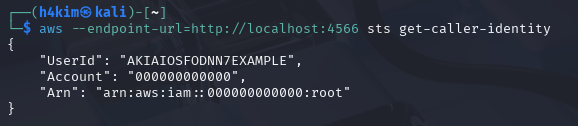

**Evidence:**

  


## Task 1: Map the Cloud Identity Landscape

| Concept | AWS Term | Purpose |
|---|---|---|
| All-powerful owner | Root user | The original account owner with full control over all resources and billing. It should be protected and not used for daily administration. |
| Human/app identity | IAM User | A named identity for a person, application or service that needs credentials to access cloud resources. |
| Permission bundle | IAM Policy | A JSON permission document that defines which actions are allowed or denied on specific resources. |
| Collection of users | IAM Group | A way to manage permissions for multiple users together by attaching policies to the group. |
| Temporary identity | IAM Role | An identity that can be assumed temporarily to grant short-lived permissions without long-term user credentials. |


## Task 2: Create a Least-Privilege Admin (Stop Using Root)  

## 3. IAM design implemented

| IAM object | Permission assignment | Intended access |
|---|---|---|
| `Admins` group | AWS managed policy `AdministratorAccess` | Full administration for members of the group |
| `CloudAdmin_hakim` user | Membership in `Admins` | Inherits administrative permission through the group |
| `Analyst_hakim` user | AWS managed policy `AmazonS3ReadOnlyAccess` attached directly | Read-only access to Amazon S3 |

This structure makes the administrator permission group-based: privileges can be assigned or removed by changing group membership rather than attaching the same policy individually to every administrator. The analyst is restricted to the S3 read-only managed policy, so it does not receive the broad permissions granted to the `Admins` group.

## 4. Procedure and verification

### Pre-check — Verify the LocalStack caller identity

```bash
aws --endpoint-url=http://localhost:4566 sts get-caller-identity
```

**Why:** `sts get-caller-identity` is a read-only check of endpoint connectivity and the CLI identity context. Explicitly providing the endpoint makes sure the request is sent to LocalStack.

**Result:** The output identifies the LocalStack root principal in account `000000000000`, not a live AWS account.


### Step 1 — Configure the LocalStack endpoint

Define the endpoint option before any IAM command.

```bash
EP='--endpoint-url=http://localhost:4566'
```

**Why:** LocalStack emulates AWS services locally. Supplying this endpoint directs the AWS CLI to the lab service instead of AWS.

**Result:** The `EP` variable was configured as shown in Evidence 1 above.

### Step 2 — Create the administrator group

```bash
aws $EP iam create-group --group-name Admins
```

**Why:** A group is a reusable permission container. Creating `Admins` first allows administrator privileges to be governed centrally.

**Result:** The response confirms the `Admins` group was created with path `/` and ARN `arn:aws:iam::000000000000:group/Admins`.

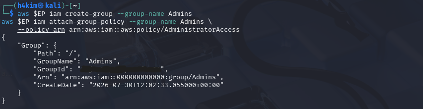

### Step 3 — Attach the administrator managed policy

```bash
aws $EP iam attach-group-policy --group-name Admins \
  --policy-arn arn:aws:iam::aws:policy/AdministratorAccess
```

**Why:** `AdministratorAccess` is an AWS-managed policy that grants broad administrative permissions. Attaching it to the group, rather than directly to a user, supports consistent administration and simpler future user management.

**Result:** The attach command completed successfully.

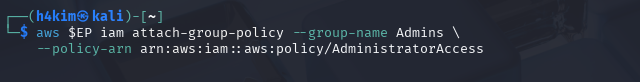

### Step 4 — Verify the group policy attachment

```bash
aws $EP iam list-attached-group-policies --group-name Admins
```

**Why:** A successful attach command alone is not sufficient evidence of the final configuration. This query confirms the policy currently associated with the group.

**Result:** The output lists `AdministratorAccess` with policy ARN `arn:aws:iam::aws:policy/AdministratorAccess`.

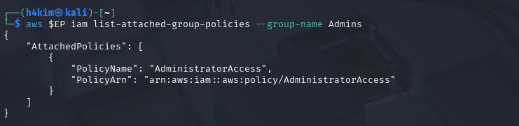

### Step 5 — Create the cloud administrator user

```bash
aws $EP iam create-user --user-name CloudAdmin_hakim
```

**Why:** An IAM user represents a distinct principal. Creating a named administrative user makes activity attributable to that identity instead of relying on a shared account credential.

**Result:** `CloudAdmin_hakim` was created successfully.

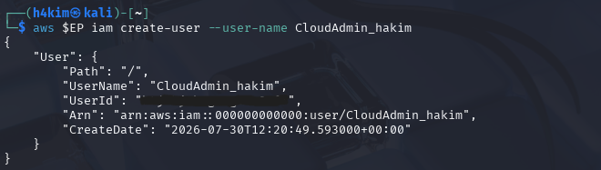

### Step 6 — Add the administrator user to the group

```bash
aws $EP iam add-user-to-group --group-name Admins \
  --user-name CloudAdmin_hakim
```

**Why:** The user now receives the policy granted to `Admins` through group membership. This is preferable to duplicating the `AdministratorAccess` attachment on the individual user.

**Result:** The command completed without error.


### Step 7 — Verify the administrator group membership

```bash
aws $EP iam get-group --group-name Admins
```

**Why:** This checks both parts of the relationship: that the correct group exists and that `CloudAdmin_hakim` is listed as a member.

**Result:** The `Users` array contains `CloudAdmin_hakim`, and the returned group is `Admins`.

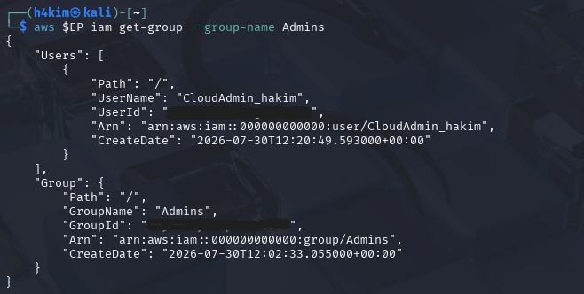  


## Task 3: Enforce Least Privilege with a Scoped Policy  

### Step 8 — Create the analyst user

```bash
aws $EP iam create-user --user-name Analyst_hakim
```

**Why:** The analyst is a separate identity with a different job function. Separation prevents analyst activity from inheriting administrator permissions.

**Result:** `Analyst_hakim` was created successfully.

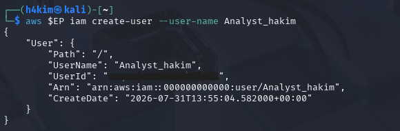

### Step 9 — Grant the analyst read-only S3 access

```bash
aws $EP iam attach-user-policy --user-name Analyst_hakim \
  --policy-arn arn:aws:iam::aws:policy/AmazonS3ReadOnlyAccess
```

**Why:** The AWS-managed `AmazonS3ReadOnlyAccess` policy permits S3 viewing/listing actions without allowing object modification or broader AWS administration. This implements least privilege for an analyst who only needs to inspect S3 data.

**Result:** The policy attachment command completed successfully.

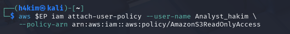

### Step 10 — Verify the analyst policy

```bash
aws $EP iam list-attached-user-policies --user-name Analyst_hakim
```

**Why:** This confirms the user’s effective directly attached managed-policy assignment after configuration.

**Result:** The output lists only `AmazonS3ReadOnlyAccess`, matching the required analyst permission.

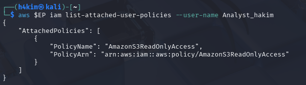  


## Task 4: Credential Hygiene & Access Keys 

### Step 11 — Create an access key for the analyst

```bash
aws $EP iam create-access-key --user-name Analyst_hakim
```

**Why:** An access key provides programmatic authentication for an IAM user. It consists of an access key ID and a secret access key; the secret is displayed only at creation time.

**Result:** An active access key was created for `Analyst_hakim`.

> Security note: The creation screenshot is intentionally not embedded because it exposes a secret access key. In a real environment, a credential exposed in a screenshot, repository, or report must be treated as compromised: create a replacement key if needed, update the workload, deactivate the exposed key, then delete it. LocalStack credentials are used only for this lab, but the same handling principle applies.

### Step 12 — Verify that the access key is active

```bash
aws $EP iam list-access-keys --user-name Analyst_hakim
```

**Why:** Listing key metadata verifies the key’s owner, identifier, and lifecycle state without displaying the secret value.

**Result:** The key metadata belongs to `Analyst_hakim` and its status is `Active`.

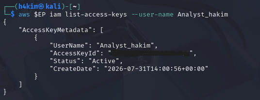

### Step 13 — Deactivate the access key and verify the state change

```bash
aws $EP iam update-access-key --user-name Analyst_hakim \
  --access-key-id <ACCESS_KEY_ID> --status Inactive

aws $EP iam list-access-keys --user-name Analyst_hakim
```

Replace `<ACCESS_KEY_ID>` with the key identifier returned by the creation command; do not use or record the secret key here.

**Why:** Deactivation is a safer first revocation step than immediate deletion. It stops the credential being used while preserving its metadata for troubleshooting or an orderly rotation. Once the replacement credential is confirmed, the inactive key should be deleted according to the organisation’s retention and key-rotation procedure.

**Result:** The final key listing reports the same access key with status `Inactive`, proving that the lifecycle update took effect.

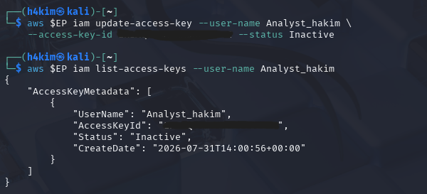

## 5. Final verification summary

The completed configuration satisfies the Part A IAM objectives:

- The AWS CLI connection and LocalStack caller identity were verified with `sts get-caller-identity` before IAM configuration.
- The `Admins` group was created and has `AdministratorAccess` attached.
- `CloudAdmin_hakim` was created and added to `Admins`, inheriting the group’s administrative permission.
- `Analyst_hakim` was created with the narrower `AmazonS3ReadOnlyAccess` policy.
- An analyst access key was created, checked while active, then changed to `Inactive` and verified.

## 6. Security considerations

`AdministratorAccess` is deliberately broad and should be assigned only to trusted administrator identities. For routine work, a more restricted role should be used. Group-based permissions are easier to audit and revoke than repeated direct policy attachments. Access keys must be stored only in an approved secret manager or protected environment-variable/credential mechanism, never in reports, source control, or screenshots. Key status should be reviewed regularly, rotated when required, and inactive keys should be removed after they are no longer needed.
