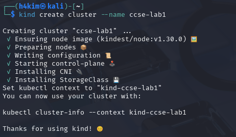
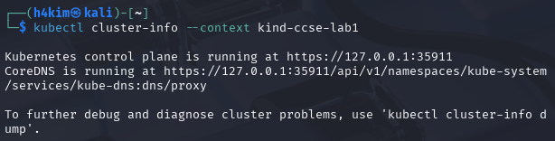
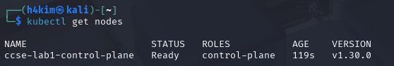
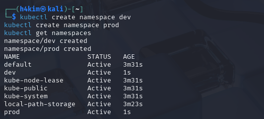
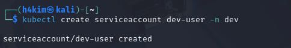
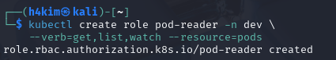
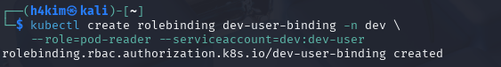
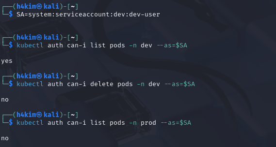
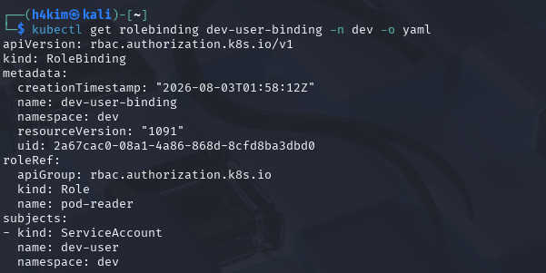

# Lab 1: Account Security and IAM

## Course Information

**Course:** IKB42603 Cloud Computing Security Essentials  
**Lab:** IKB42603_Lab1_Account_Security_and_IAM  
**Name:** Muhammad Amirul Hakim Bin Walid  
**Student ID:** 52215124636   
**Date:** 30 July 2026  

## Part A — Cloud Account Security and Identity Access Management

## 1. Purpose

This part of the laboratory implements a simple Identity and Access Management (IAM) design in a local AWS-compatible environment. The work demonstrates how identities, groups, managed policies, and access keys are created and checked using AWS CLI commands. The design separates a full-administration role from a read-only analyst role, which is a basic application of least privilege. This lab demonstrated account security and access control using two local platforms:

- LocalStack IAM was used to simulate AWS IAM users, groups, policies and access keys.
- Kubernetes RBAC was used to enforce real authorization decisions using roles and role bindings.

## 2. Environment and important conventions

The commands were run from a Kali Linux terminal. The CLI endpoint was set to LocalStack rather than a live AWS account; therefore, the ARNs use the LocalStack placeholder account ID `000000000000`. This is expected for the lab environment.

The variable `$EP` is used throughout the commands so that every CLI request is sent to the LocalStack API endpoint. Using one variable reduces repetition and avoids accidentally issuing a command to a different AWS endpoint.

```bash
EP='--endpoint-url=http://localhost:4566'
```

Before making IAM changes, the LocalStack connection was validated with AWS Security Token Service (STS). This confirms that the CLI is using LocalStack rather than a live AWS account.

```bash
aws --endpoint-url=http://localhost:4566 sts get-caller-identity
```

The returned account ID `000000000000` and ARN `arn:aws:iam::000000000000:root` are the expected LocalStack root identity for this laboratory environment.


**Evidence:**

  


## Task 1: Map the Cloud Identity Landscape

| Concept | AWS Term | Purpose |
|---|---|---|
| All-powerful owner | Root user | The original account owner with full control over all resources and billing. It should be protected and not used for daily administration. |
| Human/app identity | IAM User | A named identity for a person, application or service that needs credentials to access cloud resources. |
| Permission bundle | IAM Policy | A JSON permission document that defines which actions are allowed or denied on specific resources. |
| Collection of users | IAM Group | A way to manage permissions for multiple users together by attaching policies to the group. |
| Temporary identity | IAM Role | An identity that can be assumed temporarily to grant short-lived permissions without long-term user credentials. |


## Task 2: Create a Least-Privilege Admin (Stop Using Root)  

## 3. IAM design implemented

| IAM object | Permission assignment | Intended access |
|---|---|---|
| `Admins` group | AWS managed policy `AdministratorAccess` | Full administration for members of the group |
| `CloudAdmin_hakim` user | Membership in `Admins` | Inherits administrative permission through the group |
| `Analyst_hakim` user | AWS managed policy `AmazonS3ReadOnlyAccess` attached directly | Read-only access to Amazon S3 |

This structure makes the administrator permission group-based: privileges can be assigned or removed by changing group membership rather than attaching the same policy individually to every administrator. The analyst is restricted to the S3 read-only managed policy, so it does not receive the broad permissions granted to the `Admins` group.

## 4. Procedure and verification

### Pre-check — Verify the LocalStack caller identity

```bash
aws --endpoint-url=http://localhost:4566 sts get-caller-identity
```

**Why:** `sts get-caller-identity` is a read-only check of endpoint connectivity and the CLI identity context. Explicitly providing the endpoint makes sure the request is sent to LocalStack.

**Result:** The output identifies the LocalStack root principal in account `000000000000`, not a live AWS account.


### Step 1 — Configure the LocalStack endpoint

Define the endpoint option before any IAM command.

```bash
EP='--endpoint-url=http://localhost:4566'
```

**Why:** LocalStack emulates AWS services locally. Supplying this endpoint directs the AWS CLI to the lab service instead of AWS.

**Result:** The `EP` variable was configured as shown in Evidence 1 above.

### Step 2 — Create the administrator group

```bash
aws $EP iam create-group --group-name Admins
```

**Why:** A group is a reusable permission container. Creating `Admins` first allows administrator privileges to be governed centrally.

**Result:** The response confirms the `Admins` group was created with path `/` and ARN `arn:aws:iam::000000000000:group/Admins`.


### Step 3 — Attach the administrator managed policy

```bash
aws $EP iam attach-group-policy --group-name Admins \
  --policy-arn arn:aws:iam::aws:policy/AdministratorAccess
```

**Why:** `AdministratorAccess` is an AWS-managed policy that grants broad administrative permissions. Attaching it to the group, rather than directly to a user, supports consistent administration and simpler future user management.

**Result:** The attach command completed successfully.


### Step 4 — Verify the group policy attachment

```bash
aws $EP iam list-attached-group-policies --group-name Admins
```

**Why:** A successful attach command alone is not sufficient evidence of the final configuration. This query confirms the policy currently associated with the group.

**Result:** The output lists `AdministratorAccess` with policy ARN `arn:aws:iam::aws:policy/AdministratorAccess`.


### Step 5 — Create the cloud administrator user

```bash
aws $EP iam create-user --user-name CloudAdmin_hakim
```

**Why:** An IAM user represents a distinct principal. Creating a named administrative user makes activity attributable to that identity instead of relying on a shared account credential.

**Result:** `CloudAdmin_hakim` was created successfully.


### Step 6 — Add the administrator user to the group

```bash
aws $EP iam add-user-to-group --group-name Admins \
  --user-name CloudAdmin_hakim
```

**Why:** The user now receives the policy granted to `Admins` through group membership. This is preferable to duplicating the `AdministratorAccess` attachment on the individual user.

**Result:** The command completed without error.


### Step 7 — Verify the administrator group membership

```bash
aws $EP iam get-group --group-name Admins
```

**Why:** This checks both parts of the relationship: that the correct group exists and that `CloudAdmin_hakim` is listed as a member.

**Result:** The `Users` array contains `CloudAdmin_hakim`, and the returned group is `Admins`.

  


## Task 3: Enforce Least Privilege with a Scoped Policy  

### Step 8 — Create the analyst user

```bash
aws $EP iam create-user --user-name Analyst_hakim
```

**Why:** The analyst is a separate identity with a different job function. Separation prevents analyst activity from inheriting administrator permissions.

**Result:** `Analyst_hakim` was created successfully.


### Step 9 — Grant the analyst read-only S3 access

```bash
aws $EP iam attach-user-policy --user-name Analyst_hakim \
  --policy-arn arn:aws:iam::aws:policy/AmazonS3ReadOnlyAccess
```

**Why:** The AWS-managed `AmazonS3ReadOnlyAccess` policy permits S3 viewing/listing actions without allowing object modification or broader AWS administration. This implements least privilege for an analyst who only needs to inspect S3 data.

**Result:** The policy attachment command completed successfully.


### Step 10 — Verify the analyst policy

```bash
aws $EP iam list-attached-user-policies --user-name Analyst_hakim
```

**Why:** This confirms the user’s effective directly attached managed-policy assignment after configuration.

**Result:** The output lists only `AmazonS3ReadOnlyAccess`, matching the required analyst permission.

  


## Task 4: Credential Hygiene & Access Keys 

### Step 11 — Create an access key for the analyst

```bash
aws $EP iam create-access-key --user-name Analyst_hakim
```

**Why:** An access key provides programmatic authentication for an IAM user. It consists of an access key ID and a secret access key; the secret is displayed only at creation time.

**Result:** An active access key was created for `Analyst_hakim`.

> Security note: The creation screenshot is intentionally not embedded because it exposes a secret access key. In a real environment, a credential exposed in a screenshot, repository, or report must be treated as compromised: create a replacement key if needed, update the workload, deactivate the exposed key, then delete it. LocalStack credentials are used only for this lab, but the same handling principle applies.

### Step 12 — Verify that the access key is active

```bash
aws $EP iam list-access-keys --user-name Analyst_hakim
```

**Why:** Listing key metadata verifies the key’s owner, identifier, and lifecycle state without displaying the secret value.

**Result:** The key metadata belongs to `Analyst_hakim` and its status is `Active`.


### Step 13 — Deactivate the access key and verify the state change

```bash
aws $EP iam update-access-key --user-name Analyst_hakim \
  --access-key-id <ACCESS_KEY_ID> --status Inactive

aws $EP iam list-access-keys --user-name Analyst_hakim
```

Replace `<ACCESS_KEY_ID>` with the key identifier returned by the creation command; do not use or record the secret key here.

**Why:** Deactivation is a safer first revocation step than immediate deletion. It stops the credential being used while preserving its metadata for troubleshooting or an orderly rotation. Once the replacement credential is confirmed, the inactive key should be deleted according to the organisation’s retention and key-rotation procedure.

**Result:** The final key listing reports the same access key with status `Inactive`, proving that the lifecycle update took effect.


## 5. Final verification summary

The completed configuration satisfies the Part A IAM objectives:

- The AWS CLI connection and LocalStack caller identity were verified with `sts get-caller-identity` before IAM configuration.
- The `Admins` group was created and has `AdministratorAccess` attached.
- `CloudAdmin_hakim` was created and added to `Admins`, inheriting the group’s administrative permission.
- `Analyst_hakim` was created with the narrower `AmazonS3ReadOnlyAccess` policy.
- An analyst access key was created, checked while active, then changed to `Inactive` and verified.

## 6. Security considerations

`AdministratorAccess` is deliberately broad and should be assigned only to trusted administrator identities. For routine work, a more restricted role should be used. Group-based permissions are easier to audit and revoke than repeated direct policy attachments. Access keys must be stored only in an approved secret manager or protected environment-variable/credential mechanism, never in reports, source control, or screenshots. Key status should be reviewed regularly, rotated when required, and inactive keys should be removed after they are no longer needed.

---

# Part B — Enforced Access Control with Kubernetes RBAC

## 7. Objective and scope

Session B implements and verifies Kubernetes role-based access control (RBAC) in a local kind cluster. Unlike the LocalStack IAM exercise in Session A, Kubernetes actively evaluates the RBAC rules during the authorization check. The objective is to give a developer service account read-only Pod access in the `dev` namespace and prove that it cannot delete Pods or access the `prod` namespace.

## 8. Create and verify the local Kubernetes cluster

### Step 14 — Create the kind cluster

```bash
kind create cluster --name ccse-lab1
```

**Why:** kind (Kubernetes in Docker) creates an isolated, disposable Kubernetes cluster for the lab.

**Result:** The `ccse-lab1` cluster was created successfully. The command set the current `kubectl` context to `kind-ccse-lab1`.



### Step 15 — Confirm the control plane is reachable

```bash
kubectl cluster-info --context kind-ccse-lab1
```

**Why:** This verifies that the Kubernetes API server and CoreDNS service are running and reachable through the selected context.

**Result:** The Kubernetes control plane is running at `https://127.0.0.1:35911`, and CoreDNS is available through the cluster API.



### Step 16 — Confirm the node is ready

```bash
kubectl get nodes
```

**Why:** Workloads and RBAC checks require a healthy Kubernetes node.

**Result:** `ccse-lab1-control-plane` reports status `Ready`, role `control-plane`, and Kubernetes version `v1.30.0`.



## 9. Task 5 — Separate environments with namespaces

### Step 17 — Create and list namespaces

```bash
kubectl create namespace dev
kubectl create namespace prod
kubectl get namespaces
```

**Why:** Namespaces provide a logical isolation boundary in a cluster. In this lab, `dev` and `prod` represent separate environments so that permissions can be scoped independently.

**Result:** Both `dev` and `prod` were created and are `Active`.



## 10. Task 6 — Define and bind a least-privilege role

### Step 18 — Create the developer service account

```bash
kubectl create serviceaccount dev-user -n dev
```

**Why:** A service account is a Kubernetes identity for workloads or automated processes. `dev-user` is the identity that will receive the restricted developer access.

**Result:** `serviceaccount/dev-user` was created in the `dev` namespace.



### Step 19 — Create the namespaced read-only Pod role

```bash
kubectl create role pod-reader -n dev \
  --verb=get,list,watch --resource=pods
```

**Why:** The `pod-reader` Role grants only the minimum actions required to inspect Pods: `get`, `list`, and `watch`. It does not grant create, update, patch, or delete permissions. Because it is a `Role`, rather than a `ClusterRole`, its rules apply only in the `dev` namespace.

**Result:** `role.rbac.authorization.k8s.io/pod-reader` was created.



### Step 20 — Bind the role to the service account

```bash
kubectl create rolebinding dev-user-binding -n dev \
  --role=pod-reader --serviceaccount=dev:dev-user
```

**Why:** A Role defines permissions but does not grant them to anyone by itself. The RoleBinding assigns the `pod-reader` Role to `dev-user` in the same namespace.

**Result:** `rolebinding.rbac.authorization.k8s.io/dev-user-binding` was created.



## 11. Task 7 — Test that access control works

### Step 21 — Test allowed and denied actions

```bash
SA=system:serviceaccount:dev:dev-user

kubectl auth can-i list pods -n dev --as=$SA
kubectl auth can-i delete pods -n dev --as=$SA
kubectl auth can-i list pods -n prod --as=$SA
```

**Why:** `kubectl auth can-i` asks the Kubernetes API server whether the named subject is authorized for the requested action. It tests the actual RBAC decision without creating or deleting a resource.

| Request | Result | Explanation |
|---|---|---|
| List Pods in `dev` | `yes` | `dev-user` is bound to `pod-reader` in `dev`, and `list` is one of the role's permitted verbs. |
| Delete Pods in `dev` | `no` | The role grants only `get`, `list`, and `watch`; it does not include the destructive `delete` verb. |
| List Pods in `prod` | `no` | The RoleBinding is namespaced to `dev`; it grants no permission in `prod`. |

These `yes / no / no` results prove least privilege is enforced by Kubernetes RBAC: the same authenticated identity can perform only the explicitly permitted action in the explicitly permitted namespace.



## 12. RBAC verification command

The lab requires the following command output as proof that the RBAC binding is in place:

```bash
kubectl get rolebinding dev-user-binding -n dev -o yaml
```

The output confirms all required relationships:

```yaml
apiVersion: rbac.authorization.k8s.io/v1
kind: RoleBinding
metadata:
  name: dev-user-binding
  namespace: dev
roleRef:
  apiGroup: rbac.authorization.k8s.io
  kind: Role
  name: pod-reader
subjects:
- kind: ServiceAccount
  name: dev-user
  namespace: dev
```

This shows that the `dev-user` service account in `dev` receives the permissions of the namespaced `pod-reader` Role. The system-generated metadata (creation timestamp, resource version, and UID) is intentionally omitted from the transcription because it does not affect the authorization decision.



## 13. Short-answer questions

### Q1. Why is attaching policies to groups better than attaching them directly to users?

Groups centralise permission management. An administrator can attach, change, or remove a policy once on the group and the change applies consistently to all members. This reduces duplicated configuration, makes reviews and off-boarding easier, and lowers the risk that similar users accumulate different permissions over time. In this lab, `CloudAdmin_hakim` inherits administrative access from `Admins`, demonstrating this approach.

### Q2. What is the difference between an IAM User and an IAM Role?

An IAM User is a long-term named identity for a person or application. It can have permanent credentials, such as a password or access key. An IAM Role is an assumable identity with a permissions policy; it is used when needed and normally provides temporary credentials. Roles are preferable for workloads and delegated access because they avoid distributing long-lived secrets.

### Q3. Explain least privilege using the Analyst account, and how it reduces blast radius if compromised.

`Analyst_hakim` has only the `AmazonS3ReadOnlyAccess` managed policy. It may inspect permitted S3 data, but it does not have administrator permissions and cannot modify or delete S3 resources through that policy. If its credentials were compromised, an attacker would be limited to the analyst's read-only scope rather than being able to administer IAM, create new privileges, or change and delete cloud resources. The possible impact—its blast radius—is therefore much smaller than for a compromised administrator account. Read-only access can still expose confidential information, so those credentials and the accessible data remain sensitive.

### Q4. In Kubernetes, what is the difference between a Role and a RoleBinding?

A Role is a namespaced ruleset that states which verbs are permitted on which Kubernetes resources; here, `pod-reader` permits `get`, `list`, and `watch` on Pods in `dev`. A RoleBinding assigns that Role to one or more subjects, such as users, groups, or service accounts; here, `dev-user-binding` grants `pod-reader` to service account `dev-user`. The Role defines *what is allowed* and the RoleBinding defines *who receives it*.

### Q5. Why did the developer service account fail to access prod, and which security principle does that demonstrate?

The service account is `system:serviceaccount:dev:dev-user`, and its RoleBinding exists only in the `dev` namespace. The `pod-reader` Role is also namespaced, so neither object grants any permission in `prod`. Kubernetes therefore returns `no` for listing Pods in `prod`. This demonstrates least privilege and environment/namespace isolation: access is limited to the smallest required scope instead of automatically extending across the cluster.

## 14. Security best-practices checklist

| Checklist item from the lab | Status | Evidence and assessment |
|---|---|---|
| Root user is not used for daily tasks (a dedicated admin identity exists). | Complete | `CloudAdmin_hakim` was created and added to `Admins`; the root identity was used only for the initial LocalStack identity check. |
| Permissions are granted via groups/roles, not directly to individual users. | Partially complete | Administrative access is correctly inherited through `Admins`, and Kubernetes uses a Role plus RoleBinding. However, the lab explicitly attaches `AmazonS3ReadOnlyAccess` directly to `Analyst_hakim`, so this statement is not wholly true for the IAM configuration. In production, a dedicated analyst group would better satisfy this practice. |
| At least one least-privilege (read-only) identity was created and tested. | Complete | `Analyst_hakim` was created with only `AmazonS3ReadOnlyAccess`; Session B also verifies read-only Pod permissions. |
| Access keys were listed and a rotation (deactivate) was demonstrated. | Complete | The analyst key was listed while active, changed to `Inactive`, and listed again to verify the new status. |
| Kubernetes RBAC blocks an unauthorised action (delete/cross-namespace). | Complete | `dev-user` received `no` for deleting Pods in `dev` and for listing Pods in `prod`. |

## 15. Part B conclusion

The kind cluster was healthy, and the RBAC policy was enforced as designed. `dev-user` could list Pods only in `dev`; it could neither delete Pods there nor list Pods in `prod`. This demonstrates that authentication identifies the service account, while authorization evaluates the Role and RoleBinding rules to allow or deny each request. The result is a practical, namespaced implementation of least privilege.

## 16. Optional cleanup after assessment

Run the following only after screenshots and report verification are complete, because it removes the lab environments:

```bash
kind delete cluster --name ccse-lab1
docker stop localstack && docker rm localstack
```

