# Lab 2: Secure Isolation and Multitenancy

## Course Information

**Course:** IKB42603 Cloud Computing Security Essentials  
**Lab:** Secure Isolation and Multitenancy  
**Name:** Muhammad Amirul Hakim Bin Walid  
**Student ID:** 52215124636   
**Date:**  11 August 2026  


**Lab focus:** Compute, network, and storage isolation using Docker and Kubernetes  
**Platform:** kind Kubernetes cluster with Calico NetworkPolicy enforcement

## Objective

This lab models two customers, `tenant-a` and `tenant-b`, on one Kubernetes cluster. It demonstrates that namespace separation alone is not sufficient to protect tenants. The lab first shows the default-open risk, then applies controls for resource, network, and secret isolation, and finally examines data remanence.

## Environment and policy-capable cluster

A kind cluster called `ccse-lab2` was created with the default CNI disabled and pod CIDR `10.244.0.0/16`. Calico v3.27.0 was installed afterwards. This matters because a Kubernetes `NetworkPolicy` only has an effect when the selected CNI implements policy enforcement.

The Calico rollout completed successfully, as shown in the evidence below.

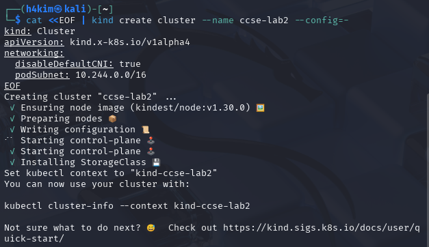

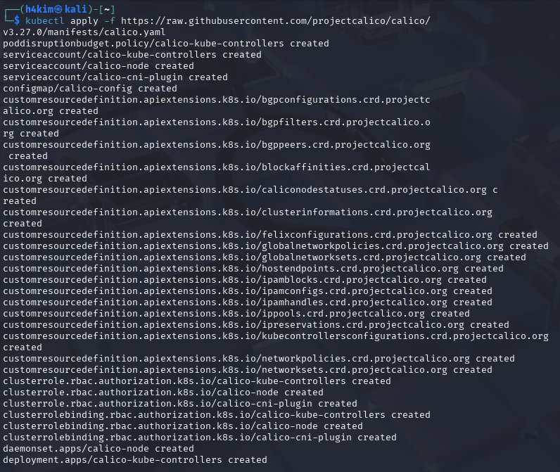

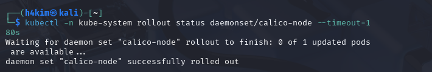

## Task 1 — Two tenants on one shared cluster

Two separate namespaces were created to represent independent tenants:

```bash
kubectl create namespace tenant-a
kubectl create namespace tenant-b
```

An NGINX `web` deployment and ClusterIP service were then created in each namespace:

```bash
kubectl -n tenant-a create deployment web --image=nginx
kubectl -n tenant-b create deployment web --image=nginx
kubectl -n tenant-a expose deployment web --port=80
kubectl -n tenant-b expose deployment web --port=80
kubectl get pods,svc -n tenant-a
kubectl get pods,svc -n tenant-b
```

The creation output confirms that both deployments and both services were created. The captured `get` output identifies the ClusterIP services: `10.96.57.154` in `tenant-a` and `10.96.10.102` in `tenant-b`. At the moment of that screenshot, both NGINX pods were still in `ContainerCreating`; this is normal immediately after deployment and is not treated here as proof that they were Ready.

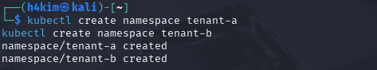

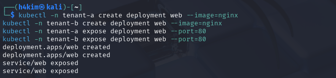

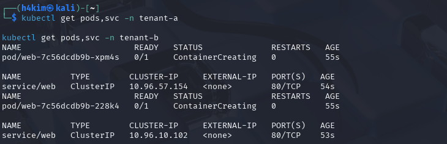

**Isolation dimension exercised:** compute/logical tenancy. Namespaces provide an administrative and naming boundary, but they do not automatically prevent pod-to-pod communication or resource exhaustion.

## Task 2 — Default-open cross-tenant access

The ClusterIP of `tenant-b/web` was obtained:

```bash
kubectl get svc web -n tenant-b -o jsonpath='{.spec.clusterIP}'; echo
# Result: 10.96.10.102
```

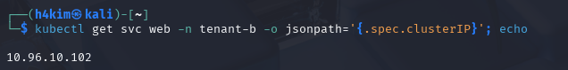

A temporary curl pod was run in `tenant-a` to reach that address:

```bash
kubectl -n tenant-a run probe --rm -it --image=curlimages/curl --restart=Never \
  -- curl -s -m 5 http://10.96.10.102 -o /dev/null -w 'HTTP %{http_code}\n'
```

The result was **`HTTP 200`**. Therefore, a workload in `tenant-a` successfully accessed the web service in `tenant-b` before a NetworkPolicy was applied. This is the expected default-open behaviour and demonstrates the multi-tenancy risk: namespaces alone did not form a network-security boundary.

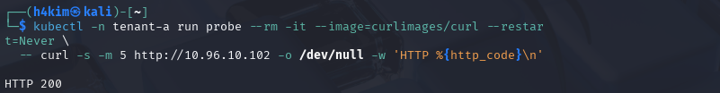

**Isolation dimension exercised:** network isolation (risk demonstration). No ingress restriction was present, so cross-namespace traffic was permitted.

## Task 3 — Resource quota against the noisy-neighbour problem

A `ResourceQuota` named `tenant-a-quota` was applied to limit the aggregate consumption of `tenant-a`:

```yaml
apiVersion: v1
kind: ResourceQuota
metadata:
  name: tenant-a-quota
  namespace: tenant-a
spec:
  hard:
    requests.cpu: "1"
    requests.memory: 512Mi
    pods: "5"
```

The verification output shows the quota is present with hard limits of five pods, one CPU request, and 512 MiB memory requests. This limits the amount of shared capacity this tenant can reserve and reduces the risk that it starves other tenants.

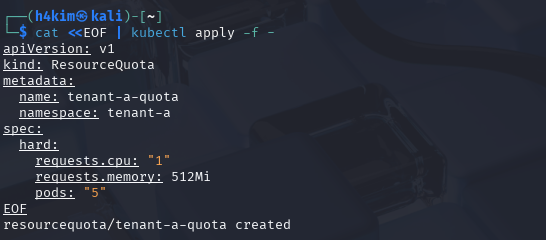

**Isolation dimension exercised:** compute/resource isolation. The quota is not a complete performance guarantee, but it constrains a tenant's requested resources and pod count.

## Task 4 — Default-deny ingress policy

The following NetworkPolicy was created in `tenant-b`:

```yaml
apiVersion: networking.k8s.io/v1
kind: NetworkPolicy
metadata:
  name: default-deny-ingress
  namespace: tenant-b
spec:
  podSelector: {}
  policyTypes:
    - Ingress
```

Because `podSelector: {}` selects every pod in `tenant-b` and there are no ingress rules, this policy denies all ingress to those pods. With Calico enforcing policy, this should make the same `tenant-a` to `tenant-b` probe time out or fail.

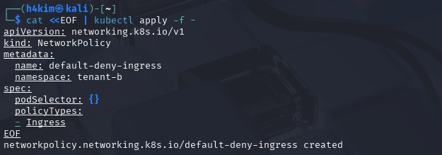

### Accurate verification result and limitation

The captured re-run of the probe did **not** reach the network. Kubernetes rejected creation of the new probe because `tenant-a-quota` requires CPU and memory requests, whereas the `curlimages/curl` pod was started without them:

> `pods "probe" is forbidden: failed quota: tenant-a-quota: must specify requests.cpu for: probe; requests.memory for: probe`

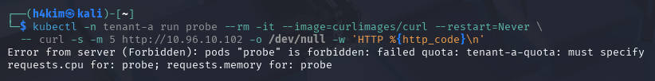

This is valid evidence that the ResourceQuota is enforced, but it is **not** evidence of an ingress timeout. Consequently, the before/after network block is not fully verified by the supplied screenshots. The correct follow-up verification is to run the probe with resource requests (or delete the completed quota for the test), for example:

```bash
kubectl -n tenant-a run probe --rm -it --restart=Never --image=curlimages/curl \
  --requests='cpu=100m,memory=64Mi' \
  -- curl -s -m 5 http://10.96.10.102 -o /dev/null -w 'HTTP %{http_code}\n'
```

Expected result: no `HTTP 200`; the connection should time out/fail after five seconds. Capture that result to complete the required before/after evidence. The policy shown is strictly deny-all; if same-namespace traffic must be allowed as stated in the guide, a separate explicit allow policy is additionally required.

**Isolation dimension exercised:** network isolation. The policy configuration implements default-deny ingress for `tenant-b`, while the evidence currently proves creation rather than the final traffic-block result.

## Task 5 — Per-tenant secret access controlled by RBAC

Each namespace received a secret with a different value:

```bash
kubectl -n tenant-a create secret generic data --from-literal=value=SECRET_A
kubectl -n tenant-b create secret generic data --from-literal=value=SECRET_B
```

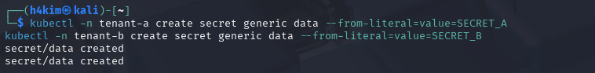

A service account `app-a` was created only in `tenant-a`. A namespaced `reader` Role granted the `get` verb over `secrets`, and RoleBinding `rb` bound that role to `tenant-a:app-a`.

```bash
kubectl -n tenant-a create serviceaccount app-a
kubectl -n tenant-a create role reader --verb=get --resource=secrets
kubectl -n tenant-a create rolebinding rb --role=reader --serviceaccount=tenant-a:app-a
```

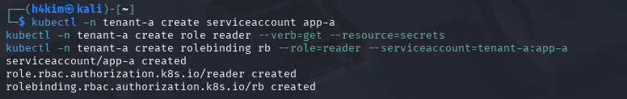

Using identity `system:serviceaccount:tenant-a:app-a`, authorization was checked in both namespaces:

```bash
kubectl auth can-i get secrets -n tenant-a --as=system:serviceaccount:tenant-a:app-a
# yes
kubectl auth can-i get secrets -n tenant-b --as=system:serviceaccount:tenant-a:app-a
# no
```

The `yes`/`no` result proves that this service account may read secrets in its own namespace but may not read the secret in `tenant-b`. The secret's existence alone is not protection; the relevant protection is the namespace-scoped RBAC grant.

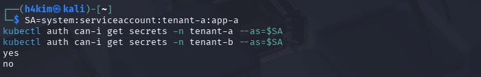

**Isolation dimension exercised:** storage/data access isolation. Kubernetes RBAC prevents this tenant identity from retrieving another tenant's secret through the API.

## Task 6 — Data remanence and secure deletion

First, a sensitive string was written into the Docker volume `ccse-vol`, synchronized, and removed with a normal `rm`:

```bash
docker run --rm -v ccse-vol:/data alpine sh -c \
  'echo SENSITIVE-PATIENT-RECORD > /data/phi.txt; sync; rm /data/phi.txt; \
   grep -a SENSITIVE /data/* 2>/dev/null; echo scan-done'
```

The command completed with `scan-done`. The absence of output from `grep` only means no readable matching file remained in the mounted directory; it does not prove the former bytes were overwritten on underlying storage. Deleted filesystem entries can leave recoverable data in free blocks, snapshots, backups, or lower storage layers.

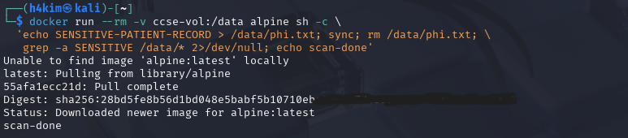

Next, a second file was overwritten with zeroes before deletion:

```bash
docker run --rm -v ccse-vol:/data alpine sh -c \
  'echo SENSITIVE > /data/phi2.txt; sync; \
   dd if=/dev/zero of=/data/phi2.txt bs=1k count=1 conv=notrunc; rm /data/phi2.txt; echo wiped'
```

The output shows that 1,024 bytes were written and reports `wiped`. Overwriting before deletion can reduce remanence on storage where the caller controls the physical blocks. In cloud environments, this guarantee is weaker because of virtualization, copy-on-write, replication, and provider-managed media. The preferred cloud approach is **cryptographic erasure**: encrypt data with a tenant-specific key and permanently destroy that key, making every remaining encrypted copy computationally unreadable.

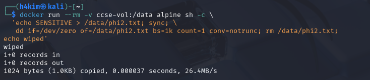

**Isolation dimension exercised:** storage isolation and data lifecycle protection.

## Verification summary

```bash
kubectl get networkpolicy -A
kubectl describe resourcequota tenant-a-quota -n tenant-a
```

The evidence lists `tenant-b/default-deny-ingress` and shows the `tenant-a-quota` hard limits. These commands verify that the policy and quota objects exist.   

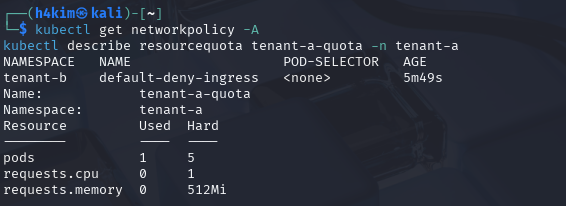   

## Short-answer questions

### Q1. Why can containers in different namespaces reach each other by default, and why is that dangerous in a multi-tenant cloud?

Namespaces are logical administrative boundaries, not automatic network firewalls. In Kubernetes, pods normally share a cluster network and services are routable across namespaces unless a NetworkPolicy restricts them. This is dangerous in a multi-tenant environment because a compromised or malicious workload in one tenant can scan, call, or exploit exposed services belonging to another tenant. The recorded `HTTP 200` from `tenant-a` to `tenant-b` demonstrates this risk directly.

### Q2. Explain the default-deny principle and how your NetworkPolicy implements it.

Default deny means traffic is rejected unless a specific rule permits it. The `default-deny-ingress` policy selects all pods in `tenant-b` and declares `Ingress` as its policy type without supplying any allowed ingress rules. Therefore, Calico should deny inbound connections to all selected `tenant-b` pods. This is safer than starting open and attempting to block every unwanted path individually. The supplied evidence confirms the policy exists, but the final traffic-block test must be repeated with resource requests because the captured probe was rejected by quota admission before it could test the policy.

### Q3. How do virtual machines and containers differ in isolation strength? When would you add a VM boundary?

Containers isolate processes using kernel namespaces and cgroups but share the host kernel. A container escape or kernel vulnerability can therefore affect the host and neighbouring containers. Virtual machines run separate guest kernels behind a hypervisor boundary, producing stronger isolation at the cost of more resource overhead and slower startup. A VM boundary is appropriate for untrusted tenants, workloads with different security classifications, strong regulatory separation, workloads needing separate kernels, or where the impact of a shared-kernel compromise is unacceptable. Runtime sandboxes such as gVisor can provide an intermediate strengthening measure.

### Q4. What is data remanence, and why is cryptographic erasure the preferred cloud solution?

Data remanence is residual information that remains recoverable after normal deletion. `rm` generally removes a filesystem reference; it does not guarantee erasure of every physical copy. In cloud storage, customers often cannot address or overwrite the underlying media reliably because of replication, snapshots, thin provisioning, and provider-managed hardware. Cryptographic erasure avoids that dependency: data is encrypted and the encryption key is irreversibly destroyed. Any remaining blocks or replicas remain, but they are useless without the key.

### Q5. Which isolation dimension did each task exercise?

| Task | Main isolation dimension | Control or observation |
| --- | --- | --- |
| 1 | Compute/logical tenant separation | Distinct Kubernetes namespaces and workload deployments |
| 2 | Network | Default-open cross-tenant service access (`HTTP 200`) |
| 3 | Compute/resources | ResourceQuota limits pods, CPU requests, and memory requests |
| 4 | Network | Calico-enforced default-deny ingress NetworkPolicy |
| 5 | Storage/data access | Namespace-scoped RBAC limits secret reads |
| 6 | Storage/data lifecycle | Overwrite-before-delete and cryptographic-erasure rationale |

## Security best-practices checklist

- [x] Tenants are separated into distinct namespaces (`tenant-a` and `tenant-b`).
- [x] Default-deny NetworkPolicy blocks cross-tenant traffic **verified before/after**.
- [x] ResourceQuota limits `tenant-a` to five pods, 1 CPU request, and 512 MiB memory requests, reducing noisy-neighbour risk.
- [x] Per-tenant secrets are unreadable by the `tenant-a:app-a` service account in `tenant-b` (`yes` for tenant-a; `no` for tenant-b).
- [x] Data remanence and overwrite-before-delete were demonstrated; cryptographic erasure is identified as the preferred cloud control.
