# Lab 3: Encryption and Key Management  

**Course:** IKB42603 Cloud Computing Security Essentials  
**Lab:**  Encryption and Key Management 
**Name:** Muhammad Amirul Hakim Bin Walid  
**Student ID:** 52215124636   
**Date:**  20 August 2026  

**Topics:** encryption at rest and in transit, KMS, envelope encryption, cryptographic erasure, integrity, and tamper-evident logs

## Objectives

This lab demonstrates how confidentiality and integrity are protected in a cloud setting. The work covers AES encryption for stored data, RSA encryption and signatures, TLS for data in transit, LocalStack KMS keys, envelope encryption, tenant separation, cryptographic erasure, and SHA-256 integrity checking.

## Environment and test data

The commands were run in a Kali Linux terminal. OpenSSL was used for cryptographic operations, Docker/Nginx for the HTTPS service, and AWS CLI against LocalStack at `http://localhost:4566` for KMS operations. The test record used throughout the lab was:

```text
Patient: Ahmad, Diagnosis: confidential
```

Evidence screenshots are stored in the `evidence/` directory. Key identifiers and ciphertext values are deliberately not reproduced in this report.

---

## Task 1 — Symmetric encryption: data at rest

### Procedure

1. Created the sensitive plaintext record:

   ```bash
   echo 'Patient: Ahmad, Diagnosis: confidential' > record.txt
   ```

   Evidence:
   
   

3. Encrypted the record using AES-256-CBC with PBKDF2 key derivation and a random salt:

   ```bash
   openssl enc -aes-256-cbc -pbkdf2 -salt -in record.txt -out record.enc
   ```

   A passphrase was entered and confirmed when prompted. Evidence:  

   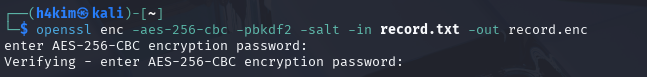

5. Displayed the encrypted file:

   ```bash
   cat record.enc
   ```

   The displayed data begins with `Salted__` and is unreadable binary data, rather than the patient record. Evidence:  

   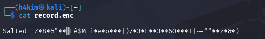

7. Decrypted the ciphertext using the same passphrase:

   ```bash
   openssl enc -d -aes-256-cbc -pbkdf2 -in record.enc -out record.dec.txt
   ```

   Evidence:  

   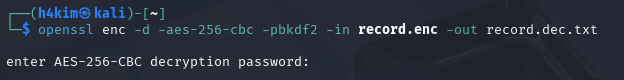

9. Compared the original and recovered files:

   ```bash
   diff record.txt record.dec.txt && echo 'MATCH: decryption successful'
   ```

   The terminal returned `MATCH: decryption successful`, proving correct recovery. Evidence:  

   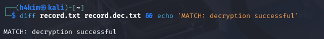

### Result

AES-256-CBC protected the record at rest. The ciphertext was not human-readable, while decryption with the correct passphrase reproduced the original file exactly.

---

## Task 2 — Asymmetric encryption and digital signatures

### Procedure

1. Generated a 2048-bit RSA private key:

   ```bash
   openssl genrsa -out private.pem 2048
   ```

   Evidence:  

   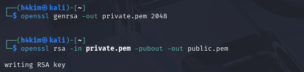

3. Derived the matching public key:

   ```bash
   openssl rsa -in private.pem -pubout -out public.pem
   ```

   Evidence:  

   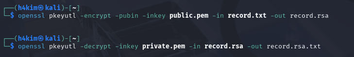

5. Encrypted the record with the public key:

   ```bash
   openssl pkeyutl -encrypt -pubin -inkey public.pem -in record.txt -out record.rsa
   ```

   Evidence:  

   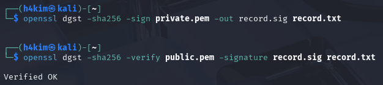

7. Decrypted the RSA ciphertext with the private key:

   ```bash
   openssl pkeyutl -decrypt -inkey private.pem -in record.rsa -out record.rsa.txt
   ```

   Evidence:  

   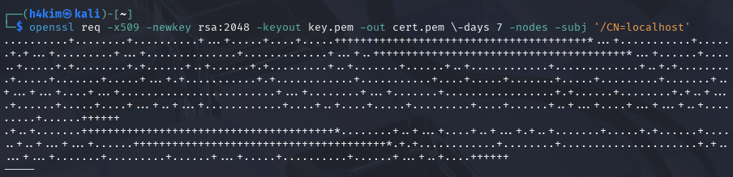

9. Signed the original record with the private key, using SHA-256:

   ```bash
   openssl dgst -sha256 -sign private.pem -out record.sig record.txt
   ```

   The final verification evidence is included in  

   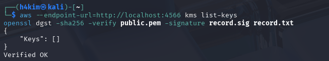.

11. Verified the signature with the public key:

   ```bash
   openssl dgst -sha256 -verify public.pem -signature record.sig record.txt
   ```

   The output was `Verified OK`. Evidence:   
   
   

### Result

The public key can encrypt data intended for the private-key holder; only the private key can decrypt it. Conversely, the private key produces a signature that the public key can verify. The `Verified OK` result provides integrity and origin authentication for the signed record.

---

## Task 3 — Encryption in transit with TLS

### Procedure

1. Generated a self-signed RSA certificate for `localhost`, valid for seven days:

   ```bash
   openssl req -x509 -newkey rsa:2048 -keyout key.pem -out cert.pem \
     -days 7 -nodes -subj '/CN=localhost'
   ```

   The certificate-generation command was completed before the HTTPS container was started.

2. Started an Nginx container, exposed HTTPS on port 8443, and mounted the certificate, private key, and test record:

   ```bash
   docker run --rm -d --name tls -p 8443:443 \
     -v "$(pwd)/cert.pem:/etc/nginx/cert.pem" \
     -v "$(pwd)/key.pem:/etc/nginx/key.pem" \
     -v "$(pwd)/record.txt:/usr/share/nginx/html/record.txt" nginx
   ```

   Docker downloaded and started the Nginx image. Evidence:  

   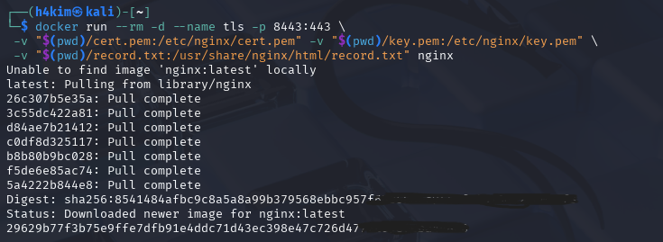

4. Retrieved the record over HTTPS, accepting the self-signed certificate for this lab:

   ```bash
   curl -k https://localhost:8443/record.txt
   ```

   The record was returned successfully. Evidence:  

   

### Result

The application data was delivered through a TLS channel. Although `-k` bypasses certificate validation and is appropriate only for this self-signed lab certificate, TLS encrypts the traffic in transit; a passive network observer would not see the record as plaintext.

---

## Task 4 — Create and use a KMS master key

### Procedure

1. Configured the LocalStack endpoint:

   ```bash
   EP='--endpoint-url=http://localhost:4566'
   ```

   Evidence:  

   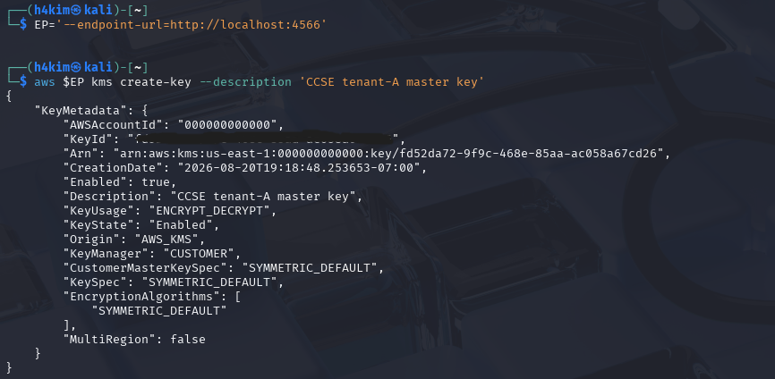

3. Created the tenant-A customer-managed KMS key:

   ```bash
   aws $EP kms create-key --description 'CCSE tenant-A master key'
   ```

   The response showed an enabled, symmetric KMS key for `ENCRYPT_DECRYPT`. The KeyId was saved as `KEY_A` but is redacted in the evidence/report. Evidence:  
     
     

5. Used the tenant-A KMS key to encrypt the small plaintext `hello`:

   ```bash
   aws $EP kms encrypt --key-id $KEY_A --plaintext "$(echo -n 'hello' | base64)" \
     --query CiphertextBlob --output text
   ```

   KMS returned a Base64 ciphertext blob. Evidence:  

   

### Result

The KMS key is the key-encrypting key (master key) used to protect small secrets directly and, more commonly, data keys used for larger objects.

---

## Task 5 — Envelope encryption

### Procedure

1. Requested a 256-bit data key from KMS:

   ```bash
   aws $EP kms generate-data-key --key-id $KEY_A --key-spec AES_256 \
     --query '[Plaintext,CiphertextBlob]' --output text
   ```

   The output contained two values: a plaintext data key and its KMS-wrapped ciphertext copy. Evidence:  

   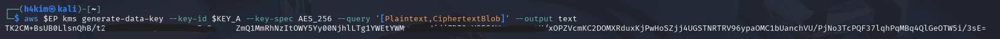  

3. Saved the plaintext value as `datakey.b64` and the wrapped value as `datakey.enc`, then decoded the plaintext data key locally:

   ```bash
   base64 -d datakey.b64 > datakey.bin
   ```

   Evidence:  

     

5. Encrypted `record.txt` locally with the plaintext data key:

   ```bash
   openssl enc -aes-256-cbc -pbkdf2 -in record.txt -out record.env.enc \
     -pass file:./datakey.bin
   ```

   Evidence:  
    
   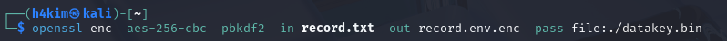   

7. Destroyed the on-disk plaintext key material:

   ```bash
   rm datakey.bin datakey.b64
   echo 'Only the KMS-wrapped data key (datakey.enc) remains.'
   ```

   The confirmation states that only `datakey.enc`, the wrapped data key, remains. Evidence:  

   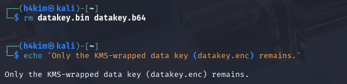  

### Result

`record.env.enc` is encrypted locally with a short-lived AES data key. `datakey.enc` is retained so that KMS can later unwrap the data key for authorised decryption. The plaintext data key was removed immediately after use.

---

## Task 6 — Per-tenant keys and cryptographic erasure

### Procedure

1. Created a second customer-managed key for tenant B:

   ```bash
   aws $EP kms create-key --description 'CCSE tenant-B master key'
   KEY_B=<tenant-B-KeyId>
   ```

   The output shows a separate enabled symmetric key with the description `CCSE tenant-B master key`. Evidence:  

   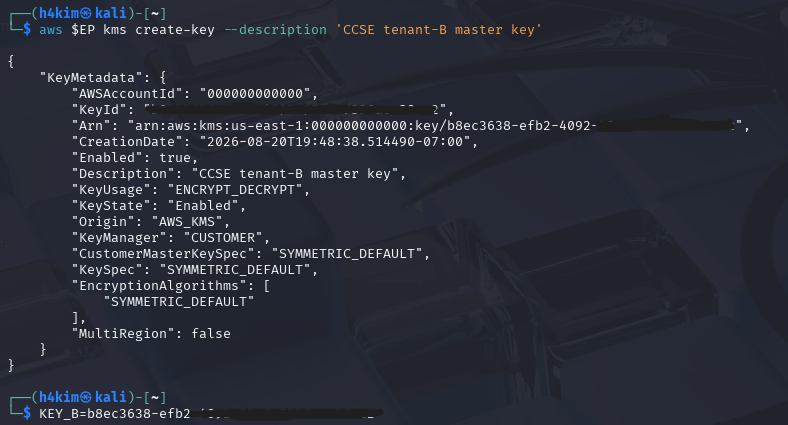  

3. Scheduled tenant A's key for deletion with the minimum seven-day window:

   ```bash
   aws $EP kms schedule-key-deletion --key-id $KEY_A --pending-window-in-days 7
   ```

   The response reported `KeyState: PendingDeletion` and `PendingWindowInDays: 7`. Evidence:  

   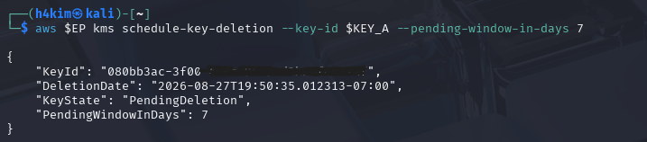  

5. The evidence then cancels the deletion and disables the tenant-A key:

   ```bash
   aws $EP kms cancel-key-deletion --key-id $KEY_A
   aws $EP kms disable-key --key-id $KEY_A
   ```

   Evidence:  

   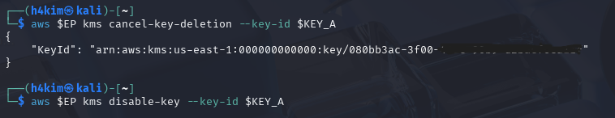  

7. Attempted to decrypt the wrapped data key:

   ```bash
   aws $EP kms decrypt --ciphertext-blob fileb://datakey.enc 2>&1 | head -3
   ```

   The operation failed. The captured error is `InvalidCiphertextException`: LocalStack was unable to deserialize the ciphertext blob. Evidence:  

   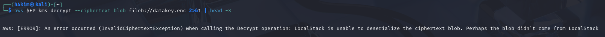  

### Result and interpretation

Tenant A and tenant B use different KMS keys, which provides cryptographic isolation: a tenant-B key is not an authorised substitute for tenant A's wrapped data key. Disabling or ultimately deleting tenant A's key makes its wrapped data key inaccessible, and without that data key the encrypted record cannot be decrypted.

The screenshot conclusively demonstrates a failed decryption attempt, but its exact error is a malformed/unreadable ciphertext-blob error rather than an explicit `DisabledException`. Therefore, it should be reported as a failed unwrap attempt; to demonstrate the disabled-key condition unambiguously, re-run the command with the original unmodified `datakey.enc` and confirm a KMS disabled-key error.

---

## Task 7 — Integrity and tamper-evident hash chain

### Procedure

1. Calculated the SHA-256 digest of the original record:

   ```bash
   sha256sum record.txt
   ```

   The recorded digest was:

   ```text
   9345a32351cc1ad03e8b318059b753da6cd4e325688da97a01599b32bc945dd5  record.txt
   ```

   Evidence:  

   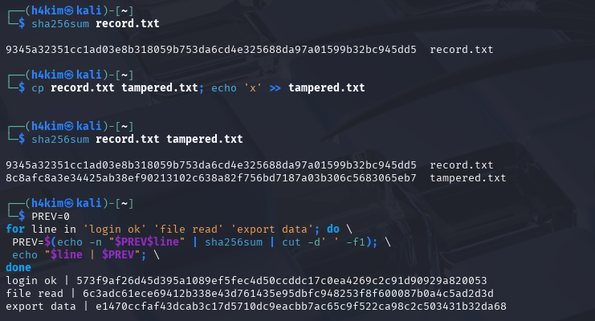  

3. Created a copy, appended `x`, and recalculated both hashes:

   ```bash
   cp record.txt tampered.txt; echo 'x' >> tampered.txt
   sha256sum record.txt tampered.txt
   ```

   The hashes differed:

   ```text
   9345a32351cc1ad03e8b318059b753da6cd4e325688da97a01599b32bc945dd5  record.txt
   8c8afc8a0364425ab38ef90213102c638a82f756bd7187a03b306c5683065eb7  tampered.txt
   ```

   Evidence:  

     

5. Built a three-entry hash chain, starting with `PREV=0`:

   ```bash
   PREV=0
   for line in 'login ok' 'file read' 'export data'; do
     PREV=$(echo -n "$PREV$line" | sha256sum | cut -d' ' -f1)
     echo "$line | $PREV"
   done
   ```

   The produced chain was:

   ```text
   login ok | 573f9af26d45d395a1089ef5fec4d50ccddc17c0ea4269c2c91d90929a820053
   file read | 6c3adc61ece69412b338e43d761435e95dbfc948253f8f600087b0a4c5ad2d3d
   export data | e1470ccfaf43dcab3c17d5710dc9eacbb7ac65c9f522ca98c2c503431b32da68
   ```

   Evidence:  

     

7. Performed the final verification command:

   ```bash
   aws --endpoint-url=http://localhost:4566 kms list-keys
   openssl dgst -sha256 -verify public.pem -signature record.sig record.txt
   ```

   The signature still returned `Verified OK`. The KMS list showed no active keys at that point. Evidence:  

     

### Result

SHA-256 detected a one-character change in the file. The hash chain also links each event to the preceding state, allowing later alteration of any entry to be detected.

---

## Short-answer questions

### Q1. Compare symmetric and asymmetric encryption: speed, key distribution, and typical use.

Symmetric encryption uses the same secret key to encrypt and decrypt. It is computationally fast and is therefore used for bulk data, such as files, database fields, disk volumes, and TLS session traffic. Its difficulty is secure key distribution: both parties must obtain and protect the same secret without exposing it.

Asymmetric encryption uses a public/private key pair. It is slower and is normally used for smaller items: exchanging or wrapping symmetric data keys, authentication, digital signatures, certificates, and establishing TLS sessions. The public key can be shared widely, while the private key must remain secret. In practice, hybrid systems combine both: asymmetric cryptography protects or negotiates a symmetric key, and symmetric cryptography encrypts the data.

### Q2. Why is key management described as the weakest link, not the algorithm?

Modern standard algorithms such as AES-256, RSA, and SHA-256 are designed to resist practical cryptographic attacks when used correctly. Security usually fails elsewhere: weak passphrases, exposed private keys, keys left in source code or backups, excessive KMS permissions, poor rotation, missing audit logs, or failure to destroy keys. If an attacker obtains a valid key, strong encryption does not protect the data because the attacker can decrypt it legitimately. Consequently, controlling key generation, storage, access, rotation, revocation, backup, and deletion is the central security problem.

### Q3. Explain envelope encryption and why only the master key needs hardware-grade protection.

Envelope encryption creates a temporary data-encryption key (DEK) for the actual file and encrypts the file locally with that DEK. KMS then encrypts (wraps) the small DEK with a key-encryption key, also called the master key. The encrypted file and wrapped DEK can be stored together. When the file is needed, an authorised requester asks KMS to unwrap the DEK, uses it briefly, and discards it.

Only the master key needs the strongest controls—such as an HSM-backed KMS—because it protects many small DEKs and normally never leaves KMS in plaintext. This scales much better than sending every large file to an HSM/KMS and reduces exposure of the root cryptographic material.

### Q4. How does cryptographic erasure achieve provable deletion where overwriting cannot in the cloud?

Cryptographic erasure destroys or permanently disables the key required to decrypt ciphertext. With envelope encryption, deleting a tenant's master key (or the relevant DEK) renders all ciphertext that depends on it computationally unreadable, even if copies remain in storage, snapshots, replicas, backups, provider infrastructure, or retired media.

Overwriting cannot offer the same assurance in a cloud environment because a customer may not know every physical copy or control all replicas and backup-retention systems. Key destruction has a precise cryptographic boundary: without the key, recovery of properly encrypted data is infeasible. This relies on securely managed keys, correct key-to-data mapping, and confirmation that no alternate copy of the key exists.

### Q5. How does a hash chain make a log tamper-evident?

Each hash-chain entry is calculated from the event text plus the previous entry's hash. Therefore, an edit, deletion, reordering, or insertion changes that entry's hash and causes every later link to fail verification. A reviewer can recompute the chain from the trusted starting value and locate the first inconsistent entry.

This makes the log tamper-evident, rather than automatically tamper-proof: an attacker who can rewrite the entire log and replace the trusted final hash could conceal changes. In production, protect the chain anchor or periodic checkpoints with a digital signature, write-once storage, a separate audit system, or an external timestamping service. These controls make undetected rewriting substantially harder.

---

## Security best-practices checklist

- [x] Data at rest encrypted with AES and decryption verified by `MATCH`.
- [x] RSA public/private key roles used correctly; signature verification returned `Verified OK`.
- [x] Data retrieved through TLS over HTTPS.
- [x] Envelope encryption used; plaintext data-key files were removed after encryption.
- [x] Separate tenant-A and tenant-B KMS keys created; a post-erasure decrypt attempt failed.
- [x] Integrity checked with SHA-256 and a tamper-evident hash chain.

## Conclusion

The lab demonstrated a layered data-protection design. AES protected stored content efficiently, RSA provided secure key-pair operations and signatures, and TLS protected a network transfer. LocalStack KMS demonstrated centrally managed tenant keys and envelope encryption, where only a small master key requires high-assurance protection. Finally, SHA-256 and chained hashes showed that encryption alone does not prove integrity: integrity controls are needed to expose unauthorised changes.
