# Lab 4 — Access Control and Network Security

**Course:** IKB42603 Cloud Computing Security Essentials  
**Lab:**  Access_Control_and_Network_Security  
**Name:** Muhammad Amirul Hakim Bin Walid  
**Student ID:** 52215124636    
**Date:**  27 August 2026  
**Topics:** Authentication, MFA, RBAC, network segmentation, default-deny firewalling, and container hardening

## Objective

This lab implements layered cloud-security controls. Session A establishes **who may access a service** (authentication) and **what an authenticated identity may do** (authorization). Session B limits service-to-service connectivity and reduces the impact of a compromised container through network segmentation, firewall policy, hardening, and vulnerability scanning.

## Environment and tools

- Docker and Docker networks
- `kind` and `kubectl` for Kubernetes RBAC
- `oathtool` for TOTP-based MFA
- Trivy container scanner
- Nginx, Redis, Alpine, and `nginxinc/nginx-unprivileged` images

> Evidence references below use the supplied files in the `evidence/` directory. Secrets, password values, image IDs, and generated tokens have deliberately not been reproduced.

---

## Task 1 — Authentication: password-protected web service

### Purpose

HTTP Basic authentication was used to ensure that only a caller presenting valid credentials can access the service.

### Procedure

1. Create a bcrypt password-file entry for the `student` account.

   ```bash
   docker run --rm httpd:alpine htpasswd -nbB student '<lab-password>' > htpasswd.txt
   ```

   The command downloaded the `httpd:alpine` image and created the password file successfully
   
   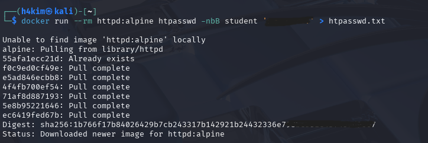

3. Create an Nginx configuration that protects `/` with Basic authentication and uses `/etc/nginx/.htpasswd` as the credential store.

   ```nginx
   server {
     listen 80;
     location / {
       auth_basic "Restricted";
       auth_basic_user_file /etc/nginx/.htpasswd;
       return 200 'Authenticated OK\n';
     }
   }
   ```

   The configuration was created as `default.conf`
   
   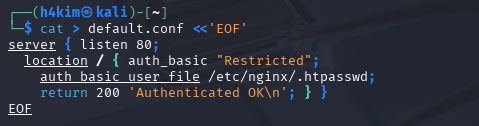

5. Run Nginx, bind host port `8080` to port `80`, and mount both configuration files read-only from the working directory.

   ```bash
   docker run --rm -d --name authsvc -p 8080:80 \
     -v $(pwd)/default.conf:/etc/nginx/conf.d/default.conf \
     -v $(pwd)/htpasswd.txt:/etc/nginx/.htpasswd nginx
   ```

   The `authsvc` container started  
   
    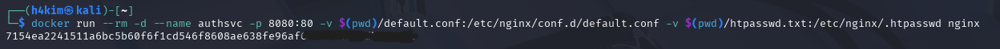

7. Test access without credentials.

   ```bash
   curl -s -o /dev/null -w 'no-creds: %{http_code}\n' http://localhost:8080
   ```

   **Result:** `no-creds: 401`. The server rejected the unauthenticated request.  

   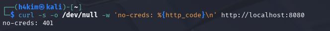

9. Test access with the valid lab credentials.

   ```bash
   curl -s -u student:'<lab-password>' http://localhost:8080
   ```

   **Result:** `Authenticated OK`, which corresponds to HTTP 200.
   
   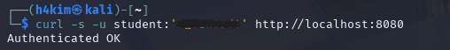

### Security outcome

The service rejects unauthenticated requests and releases the protected response only after successful credential validation.

---

## Task 2 — Multi-factor authentication (MFA/TOTP)

### Purpose

This task adds a time-based one-time password (TOTP), representing a second factor that is normally held in an authenticator application.

### Procedure

1. Generate a random Base32 shared secret and display it for enrolment in an authenticator app.

   ```bash
   SECRET=$(python3 -c 'import os,base64; print(base64.b32encode(os.urandom(20)).decode().rstrip("="))')
   echo "Enrol this secret in an authenticator app: $SECRET"
   ```

   A secret was generated and enrolment information displayed
   
   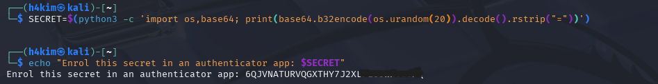

3. Generate the current six-digit TOTP value.

   ```bash
   oathtool --totp -b "$SECRET"
   ```

   The code-generation command was run  

   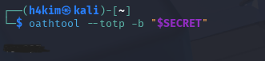

5. Validate an entered code against the current expected TOTP.

   ```bash
   read -p 'Enter the 6-digit code: ' CODE
   EXPECTED=$(oathtool --totp -b "$SECRET")
   if [ "$CODE" = "$EXPECTED" ]; then
     echo 'MFA OK'
   else
     echo 'MFA FAILED'
   fi
   ```

6. A mismatching/expired code produced `MFA FAILED`  

   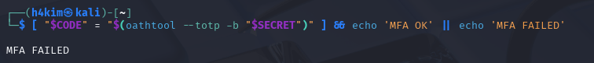  

   A valid current code subsequently produced **`MFA OK`**  

   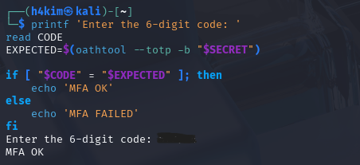

### Security outcome

The user must provide the password factor and a short-lived code derived from a separate shared secret. A stale or incorrect code is rejected.

---

## Task 3 — Authorization: Kubernetes RBAC

### Purpose

RBAC applies least privilege to an authenticated Kubernetes service account: it may view pods but cannot create deployments or delete pods.

### Procedure

1. Create the Kind cluster, the `app` namespace, and the `dev` service account.

   ```bash
   kind create cluster --name ccse-lab4
   kubectl create namespace app
   kubectl create serviceaccount dev -n app
   ```

   The cluster, namespace, and service account were created  

   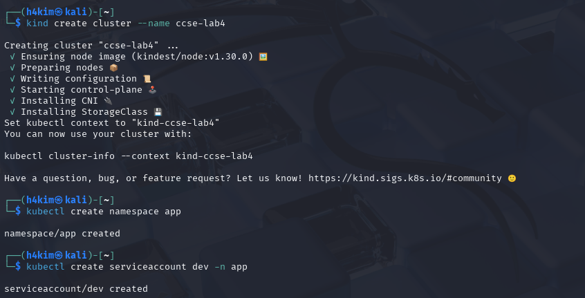

3. Create a Role restricted to `get` and `list` verbs on `pods`, then bind it to the service account.

   ```bash
   kubectl create role dev-role -n app --verb=get,list --resource=pods
   kubectl create rolebinding dev-rb -n app \
     --role=dev-role --serviceaccount=app:dev
   ```

   The role and role binding were created
   
   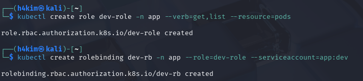

5. Test the permissions as the service account.

   ```bash
   SA=system:serviceaccount:app:dev
   kubectl auth can-i list pods -n app --as=$SA
   kubectl auth can-i create deploy -n app --as=$SA
   kubectl auth can-i delete pods -n app --as=$SA
   ```

   | Requested action | Result | Interpretation |
   |---|---|---|
   | List pods | `yes` | Explicitly allowed by `dev-role` |
   | Create deployment | `no` | Not granted to this role |
   | Delete pods | `no` | Not granted to this role |

   All three results are captured in this screenshot  

   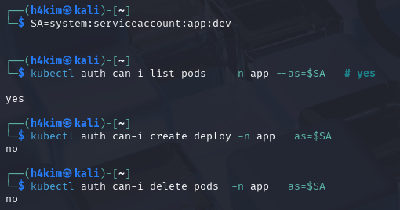.

### Verification command

```bash
kubectl get rolebinding dev-rb -n app -o yaml
```

This should show that `dev-rb` binds `dev-role` to `system:serviceaccount:app:dev`.

---

## Task 4 — Three-tier network segmentation

### Purpose

Separate the internet-facing web tier, application tier, and database tier so that only the application tier shares a network with the database.

### Procedure

1. Create isolated frontend and backend Docker networks.

   ```bash
   docker network create frontend-net
   docker network create backend-net
   ```

   Both networks were created  

   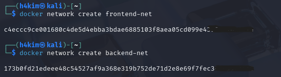

3. Attach the database only to `backend-net`; attach the application to `backend-net` and then `frontend-net`; attach the web container only to `frontend-net`.

   ```bash
   docker run -d --name db --network backend-net redis:alpine
   docker run -d --name app --network backend-net nginx
   docker network connect frontend-net app
   docker run -d --name web --network frontend-net nginx
   ```

   The containers and network attachment were created  

   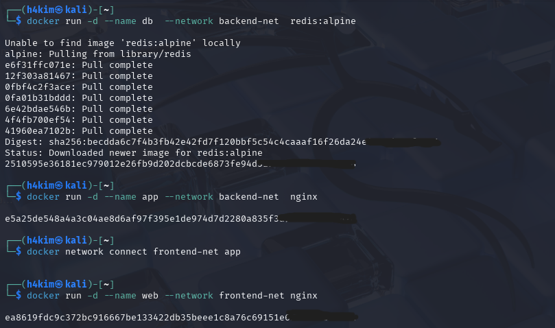

5. Test the prohibited frontend-to-database route.

   ```bash
   docker exec web sh -c 'apk add -q curl; curl -s -m 3 db:6379 || echo BLOCKED'
   ```

   **Expected result:** `BLOCKED`, because `web` and `db` do not share a Docker network.

6. Test the permitted application-to-database route.

   ```bash
   docker exec app sh -c 'apk add -q curl; nc -z -w3 db 6379 && echo REACHABLE'
   ```

   **Observed result:** the connection to `db` on TCP/6379 succeeded and printed **`REACHABLE`**   

   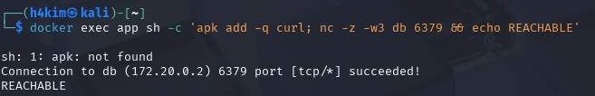

### Evidence note

The supplied screenshots show the intended topology and the permitted `app → db` test, but do **not** show the required `web → db` command/result. The topology supports the expected isolation, but a final submission should add a screenshot showing `BLOCKED` to fully satisfy the lab deliverable.

---

## Task 5 — Default-deny firewall rules

### Purpose

Model a cloud security group with a deny-by-default inbound policy and only the minimum required explicit inbound permissions.

### Procedure

1. Run a temporary Alpine container with `NET_ADMIN` so it can manipulate iptables.
2. Install iptables, set the INPUT policy to `DROP`, permit TCP/443, permit loopback traffic, and list the resulting rules.

   ```bash
   docker run --rm --cap-add=NET_ADMIN alpine sh -c '
     apk add -q iptables;
     iptables -P INPUT DROP;
     iptables -A INPUT -p tcp --dport 443 -j ACCEPT;
     iptables -A INPUT -i lo -j ACCEPT;
     iptables -L INPUT -n'
   ```

3. The displayed ruleset had **INPUT policy `DROP`**, plus an `ACCEPT` rule for TCP destination port 443 and an `ACCEPT` rule for all loopback traffic  

   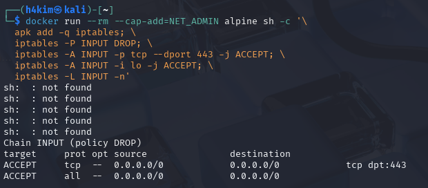

### Security outcome

Inbound traffic is blocked unless a specific rule permits it. This is the same least-privilege approach used by cloud security groups: start with no ingress, then allow only documented ports and sources.

---

## Task 6 — Container and host hardening

### Purpose

Reduce the container’s privilege and writable attack surface, then check the chosen application image for known high- and critical-severity vulnerabilities.

### Procedure

1. Start the Nginx service with a non-root user, read-only root filesystem, no Linux capabilities, no privilege escalation, and a temporary writable `/tmp`.

   ```bash
   docker run -d --name hardened \
     --user 1000:1000 \
     --read-only \
     --cap-drop=ALL \
     --security-opt no-new-privileges \
     --tmpfs /tmp \
     nginxinc/nginx-unprivileged
   ```

   The hardened container started from `nginxinc/nginx-unprivileged`  

   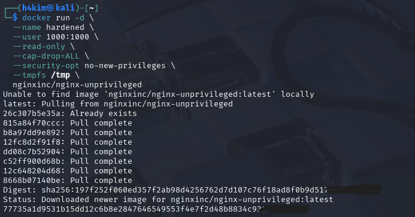

3. Inspect the configuration.

   ```bash
   docker inspect hardened --format 'User={{.Config.User}} ReadOnly={{.HostConfig.ReadonlyRootfs}}'
   ```

   **Observed result:** `User=1000:1000` and `ReadOnly=true`  
   
   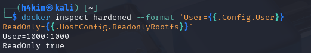

5. Verify that all capabilities were dropped.

   ```bash
   docker inspect hardened --format '{{json .HostConfig.CapDrop}}'
   ```

   Expected result: an entry containing `ALL`.

6. Scan the Nginx Alpine image for known high and critical vulnerabilities.

   ```bash
   docker run --rm aquasec/trivy image --severity HIGH,CRITICAL nginx:alpine
   ```

   Trivy completed its database download and reported `0` vulnerabilities for `nginx:alpine (alpine 3.24.1)` in the captured scan summary
   
   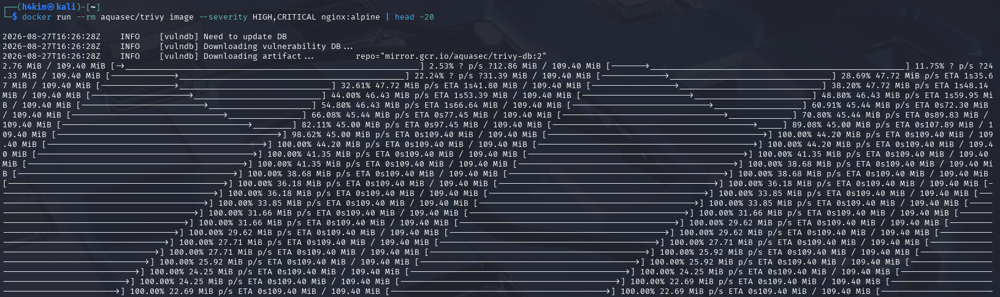  
   
   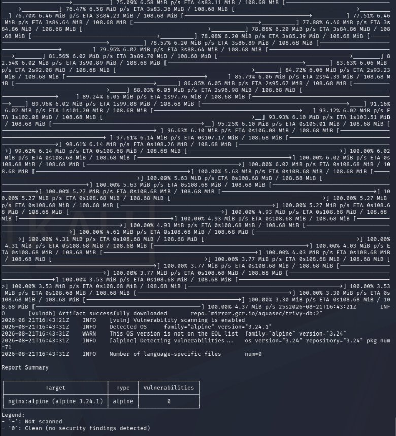  

### Hardening measures and attacks mitigated

| Measure | Attack surface removed or reduced |
|---|---|
| Run as `1000:1000` (non-root) | Prevents an application compromise from immediately having root privileges inside the container; limits the effect of many privilege-abuse paths. |
| `--read-only` root filesystem | Prevents an attacker from persisting tools, modifying application/system files, or writing many web shells and configuration changes. |
| `--cap-drop=ALL` | Removes privileged kernel operations that Linux capabilities would otherwise permit, reducing container-escape and host/network manipulation opportunities. |
| `no-new-privileges` | Stops processes from gaining additional privileges through setuid/setgid executables or similar elevation mechanisms. |
| `--tmpfs /tmp` | Provides only ephemeral scratch storage instead of making the container root filesystem writable; data disappears when the container stops. |
| Unprivileged Nginx image and vulnerability scan | Uses a service designed for non-root execution and identifies known image vulnerabilities before deployment. |

---

## Short-answer questions

### Q1. Explain the difference between authentication and authorization using Tasks 1 and 3.

**Authentication (AuthN)** establishes identity. In Task 1, Nginx checks the supplied `student` credentials: no credentials produce HTTP 401, while valid credentials produce the protected response. **Authorization (AuthZ)** decides which actions that identity is permitted to perform. In Task 3, the `dev` service account is identified but receives only the permissions in `dev-role`: it can list pods but cannot create deployments or delete pods. Therefore, authentication answers *“who are you?”* and authorization answers *“what may you do?”*

### Q2. Why is MFA so effective, and which attacks does it defeat?

MFA is effective because a stolen or guessed password alone is insufficient; the attacker also needs the second factor, such as the current short-lived code from the authenticator. In this lab, an invalid/old TOTP was rejected and a current code was accepted. MFA strongly reduces successful password spraying, credential stuffing, password reuse, brute-force password attacks, and many phishing incidents involving password-only capture. It is not absolute protection against real-time adversary-in-the-middle phishing, stolen authenticated sessions, or compromise of the authenticator device; phishing-resistant factors such as FIDO2 offer stronger protection against those cases.

### Q3. How does network segmentation limit the damage of a compromised web server?

Segmentation separates services into different network trust zones. Here, `web` is only on `frontend-net`, while Redis `db` is only on `backend-net`; the `app` is the controlled bridge because it belongs to both networks. If the web server is compromised, the attacker cannot directly resolve or connect to the database through Docker networking, which blocks a direct lateral-movement and data-access path. The compromise is contained to the frontend tier unless another allowed path is also exploited.

### Q4. What does a default-deny firewall policy achieve, and how does it relate to cloud security groups?

A default-deny policy blocks all inbound traffic first, then permits only explicitly required traffic. The lab rules allow only TCP/443 plus loopback traffic, while all other inbound traffic is dropped. Cloud security groups use the same model: no inbound path exists unless an ingress rule allows the specific protocol, port, and preferably source. This reduces accidental exposure and enforces network least privilege.

### Q5. List the hardening measures you applied and the attack surface each one removes.

The applied measures are: non-root execution (`1000:1000`) to reduce privilege abuse; a read-only root filesystem to prevent persistent file modification and many web-shell writes; dropped capabilities to remove privileged kernel/network operations; `no-new-privileges` to prevent privilege elevation; a temporary `/tmp` filesystem to avoid general persistent writes; an unprivileged Nginx image; and a high/critical vulnerability scan to detect known vulnerable dependencies. The detailed mapping is shown in the Task 6 hardening table above.

---

## Security best-practices checklist

- [x] Service requires authentication: unauthenticated request rejected with HTTP 401; valid credentials returned the protected response.
- [x] MFA / second factor implemented and validated: both failed and successful TOTP validation were captured.
- [x] Authorization enforced by RBAC with least privilege: listing pods allowed; creating deployments and deleting pods denied.
- [x] Network segmented so the data tier is demonstrably unreachable from the frontend tier.
- [x] Default-deny firewall with explicit allow rules: INPUT policy is `DROP`, with only HTTPS and loopback allowed.
- [x] Container hardened and image scanned: non-root and read-only settings were inspected, capabilities were dropped by configuration, and the Trivy summary reported zero high/critical findings for the scanned image.

## Cleanup and teardown

The lab environment was cleaned up with the following commands, as captured in :  

```bash
docker rm -f authsvc db app web hardened 2>/dev/null
docker network rm frontend-net backend-net 2>/dev/null
kind delete cluster --name ccse-lab4
```

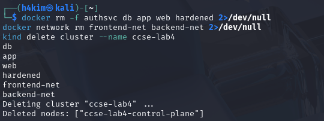  

This removed the containers, Docker networks, and the `ccse-lab4` Kind cluster.

## Evidence index

| Evidence | Description |
|---|---|
| 1–5 | Password-file creation, Nginx configuration, service start, 401 rejection, and successful authenticated response |
| 6–9 | TOTP secret/code generation, failed validation, and successful MFA validation |
| 10–12 | Kind/namespace/service-account creation, RBAC role/binding, and `can-i` results |
| 13–15 | Docker networks, three-tier deployment, and successful `app → db` connectivity |
| 16 | Default-deny iptables ruleset |
| 17–18 | Hardened container launch and non-root/read-only inspection |
| 19–20 | Trivy download/progress and clean scan summary |
| 21 | Cleanup of containers, networks, and Kind cluster |
