# Lab 5: Monitoring, Logging and Incident Detection

**Course:** IKB42603 Cloud Computing Security Essentials  
**Lab:** 5 (Weeks 9–10)  
**Environment:** Kali Linux shell, Docker, LocalStack, AWS CLI v2, CloudWatch Logs emulation

## Aim

This lab implemented a small monitoring and incident-response workflow. Authentication activity was recorded, sent to a central CloudWatch Logs service, queried for suspicious behaviour, protected with a hash chain, correlated into an incident alert, contained, and preserved as integrity-checked evidence.

## Lab evidence used

| Evidence | What it demonstrates |
|---|---|
| `1.png` | CloudWatch log group `/ccse/app` and stream `auth` were created. |
| `2.png` | The source application log `auth.log` was created with authentication and export events. |
| `3.png` | Every source-log line was shipped to the central log stream. |
| `4.png` | Centralised log events were retrieved successfully. |
| `5.png` | Failed-login events were grouped by source IP. |
| `6.png` | A SHA-256 hash chain was generated for every log line. |
| `7.png` | The export size was altered in a tampered copy. |
| `8.png` | Recalculation produced a different final hash, detecting tampering. |
| `9.png` | Correlation counts for the suspicious IP were calculated. |
| `10.png` | The correlated detection alert was generated. |
| `11.png` | A containment rule blocked the suspicious IP. |
| `12.png` | A timestamped evidence copy and SHA-256 manifest were created. |
| `13.png` | The evidence file passed SHA-256 integrity verification. |
| `14.png` | The central log group was verified with `describe-log-groups`. |
| `15.png` | Lab artefacts were cleaned up and LocalStack was stopped. |

## Session A — logging and centralisation

### Step 1 — Start LocalStack and create the log destination

LocalStack was started in Docker to emulate AWS CloudWatch Logs locally. The AWS CLI endpoint was directed to LocalStack, then the `/ccse/app` log group and `auth` stream were created.

```sh
docker run -d --name localstack -p 4566:4566 localstack/localstack
EP='--endpoint-url=http://localhost:4566'
aws $EP logs create-log-group --log-group-name /ccse/app
aws $EP logs create-log-stream --log-group-name /ccse/app --log-stream-name auth
```

Evidence `1.png` shows these commands. Evidence `14.png` later confirms the group exists, with log-group ARN ending in `/ccse/app` and `storedBytes: 397`.

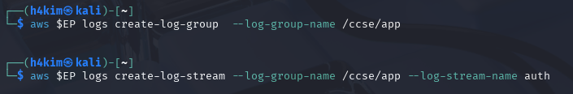

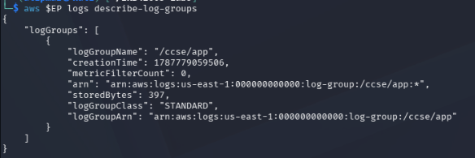

### Step 2 — Generate application authentication logs

The following events were written to `auth.log` (evidence `2.png`). They model both normal activity and an attacker probing the `admin` account.

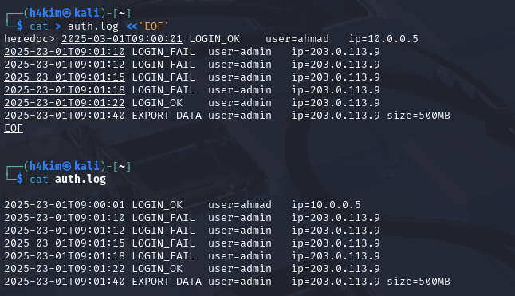

```text
2025-03-01T09:00:01 LOGIN_OK    user=ahmad   ip=10.0.0.5
2025-03-01T09:01:10 LOGIN_FAIL  user=admin   ip=203.0.113.9
2025-03-01T09:01:12 LOGIN_FAIL  user=admin   ip=203.0.113.9
2025-03-01T09:01:15 LOGIN_FAIL  user=admin   ip=203.0.113.9
2025-03-01T09:01:18 LOGIN_FAIL  user=admin   ip=203.0.113.9
2025-03-01T09:01:22 LOGIN_OK    user=admin   ip=203.0.113.9
2025-03-01T09:01:40 EXPORT_DATA user=admin   ip=203.0.113.9 size=500MB
```

### Step 3 — Centralise the logs in CloudWatch Logs

Each source-log line was sent to `/ccse/app` / `auth` with a millisecond timestamp. The central store was then read back.

```sh
TS=$(date +%s000)
while IFS= read -r line; do
  aws $EP logs put-log-events \
    --log-group-name /ccse/app \
    --log-stream-name auth \
    --log-events timestamp=$TS,message="$line" >/dev/null
  TS=$((TS+1000))
done < auth.log

aws $EP logs get-log-events \
  --log-group-name /ccse/app \
  --log-stream-name auth \
  --query 'events[].message' --output text
```

Evidence `3.png` shows the upload loop and `4.png` shows all seven messages returned from the central service. This confirms that the source events were not left only on the host.

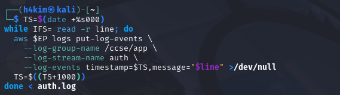

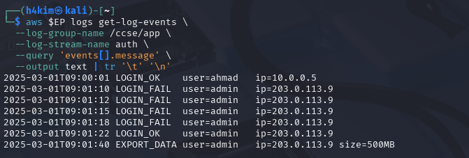

### Step 4 — Query failed logins

The failed authentication attempts were filtered, the IP field was extracted, then the results were sorted and counted.

```sh
grep LOGIN_FAIL auth.log | awk '{print $4, $5}' | sort | uniq -c
```

Output (evidence `5.png`):

```text
4 ip=203.0.113.9
```

Therefore, IP address `203.0.113.9` made four failed login attempts against `user=admin`.

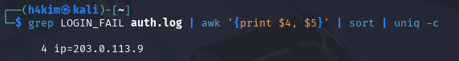

## Session B — integrity, detection and response

### Step 5 — Make the log tamper-evident with a hash chain

Each line was chained to the previous hash. The first line starts with `PREV=0`; every later SHA-256 value is calculated from the prior hash plus the current log line.

```sh
PREV=0
while IFS= read -r line; do
  PREV=$(printf '%s%s' "$PREV" "$line" | sha256sum | cut -d' ' -f1)
  printf '%s | %s\n' "$line" "$PREV"
done < auth.log > auth.chain
cat auth.chain
```

Evidence `6.png` shows the chain. Its original final hash was:

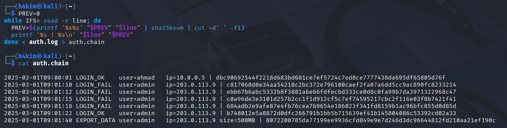

```text
8072200785da77199ee9936cfd049e9e7d246d3dc96644812fd210aa21ef190c
```

### Step 6 — Simulate and detect log tampering

The data-export value was changed from `500MB` to `5MB` in a copy, as shown in evidence `7.png`.

```sh
sed 's/500MB/5MB/' auth.log > auth.tampered
```

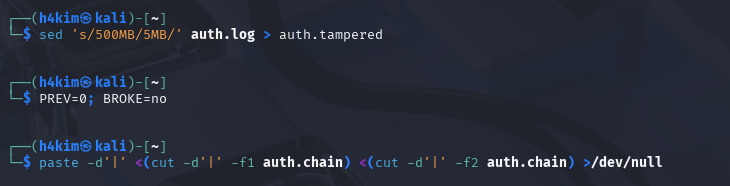

The chain was recalculated for the tampered log and its final hash compared with the original-chain final hash. Evidence `8.png` reports:

```text
Original final hash: 8072200785da77199ee9936cfd049e9e7d246d3dc96644812fd210aa21ef190c
Tampered final hash: 55152489e18ac285c0906256a92808257b89b3418c4e1ae27d8c8d5832bb0ef5
TAMPERING DETECTED: final hashes do not match
```

This proves that an alteration changes the final chain value and is detectable.

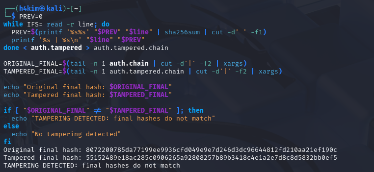

### Step 7 — Correlate events to detect the incident

The following query counted failures, successful logins and data exports from the same IP.

```sh
IP=203.0.113.9
FAILS=$(grep -c "LOGIN_FAIL.*$IP" auth.log)
SUCCESS=$(grep -c "LOGIN_OK.*$IP" auth.log)
EXPORT=$(grep -c "EXPORT_DATA.*$IP" auth.log)
echo "IP=$IP fails=$FAILS success=$SUCCESS export=$EXPORT"

if [ "$FAILS" -ge 3 ] && [ "$SUCCESS" -ge 1 ] && [ "$EXPORT" -ge 1 ]; then
  echo 'ALERT: probable brute-force -> compromise -> data exfiltration'
fi
```

Evidence `9.png` gives `fails=4 success=1 export=1`. As the thresholds were met, evidence `10.png` generated:

```text
ALERT: probable brute-force -> compromise -> data exfiltration
```

The likely sequence is four failed attempts, a successful login to the `admin` account, and a 500 MB export, all from `203.0.113.9` between 09:01:10 and 09:01:40.

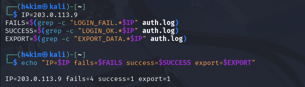

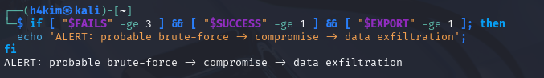

### Step 8 — Contain the attacker

The suspicious IP was blocked in an isolated Alpine container using an `iptables` input rule.

```sh
docker run --rm --cap-add=NET_ADMIN alpine sh -c \
  'apk add -q iptables; iptables -A INPUT -s 203.0.113.9 -j DROP; iptables -L INPUT -n | tail -2'
```

Evidence `11.png` shows the resulting `DROP` rule for source `203.0.113.9`. This models immediate network containment to prevent further attempts or exfiltration.

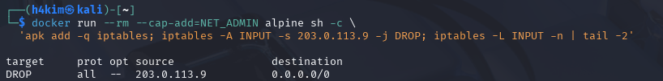

### Step 9 — Preserve and verify evidence

A timestamped copy of the original log was created, then its SHA-256 digest was recorded in a manifest.

```sh
cp auth.log evidence_$(date +%Y%m%d).log
sha256sum evidence_*.log > evidence.sha256
cat evidence.sha256
sha256sum -c evidence.sha256
```

Evidence `12.png` records the digest for `evidence_20260901.log`; evidence `13.png` verifies `evidence_20260901.log: OK`. This preserves a fixed copy and demonstrates that it had not changed since hashing.

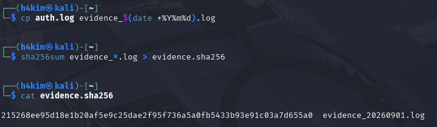

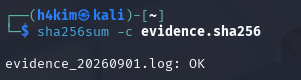

## Incident report

### Detection

The monitoring rule correlated four `LOGIN_FAIL` records, one later `LOGIN_OK` record, and one `EXPORT_DATA` record from `203.0.113.9`. It generated an alert for a probable brute-force compromise followed by data exfiltration.

### Analysis

The same external IP targeted `user=admin` four times unsuccessfully at 09:01:10, 09:01:12, 09:01:15 and 09:01:18. A successful admin login followed at 09:01:22, then a 500 MB data export at 09:01:40. The tight timeline and common IP make an unauthorised account compromise and data exfiltration the most likely explanation. The source log and central CloudWatch read-back preserve the supporting events.

### Containment

An `iptables` `DROP` rule was added for `203.0.113.9`. Its goal was to stop additional connections from the suspected attacker while the incident was investigated.

### Evidence and integrity

The original log was sent to the central `/ccse/app` CloudWatch log group and copied to timestamped evidence file `evidence_20260901.log`. Its SHA-256 value was placed in `evidence.sha256` and verified successfully. A hash chain was also created for the activity log. Altering `EXPORT_DATA` from 500 MB to 5 MB produced a different final hash, proving that the log is tamper-evident.

### Lesson learned

Individual log lines did not conclusively show an incident. Centralised, integrity-protected logs and correlation were needed to reveal the attack sequence quickly. In a production environment, the final hash or complete chain should also be forwarded to a separate append-only store, so an attacker who compromises the application cannot rewrite the audit trail.

## Short-answer questions

### Q1. What is the difference between a log and an event? Give an example of each from this lab.

A **log** is a durable, timestamped record of something that happened. For example, `2025-03-01T09:01:10 LOGIN_FAIL user=admin ip=203.0.113.9` is a record retained in `auth.log` and centralised in CloudWatch. An **event** is a meaningful occurrence or trigger derived from activity, often acted on in near real time. In this lab, the event was the alert, `probable brute-force -> compromise -> data exfiltration`, triggered when correlation found four failures, a success and an export from the same IP.

### Q2. Why must audit logs be tamper-proof, and how does a hash chain achieve this?

Audit logs must be tamper-proof so they remain trustworthy for investigations, incident response and compliance. If an attacker could delete or alter the export record, investigators could not reliably reconstruct what occurred. A hash chain computes each line's hash using both that line and the previous line's hash. Changing `500MB` to `5MB` changes that hash and every following link, resulting in a different final hash. Evidence `8.png` shows this mismatch and therefore detects alteration.

### Q3. How did correlation detect an incident that no single log line revealed?

No one log line proves compromise: a failed login can be a typo, a successful login can be legitimate, and an export may be authorised. Correlation linked all three behaviours to `203.0.113.9` in a short time window: four failed attempts, then a successful `admin` login, then a 500 MB export. This pattern satisfies the detection rule and reveals the likely brute-force-to-exfiltration attack sequence.

### Q4. List the incident-response steps performed and the goal of each.

| Step | Action performed | Goal |
|---|---|---|
| Detect | Queried and correlated failed logins, successful login and export events. | Identify the probable attack and affected IP. |
| Contain | Added an `iptables` `DROP` rule for `203.0.113.9`. | Stop further access and potential data loss. |
| Collect evidence | Created `evidence_20260901.log` and `evidence.sha256`; verified the hash. | Preserve an integrity-checkable copy for investigation. |
| Document | Recorded the timeline, alert, containment and lesson learned in this report. | Maintain an auditable incident record and support follow-up. |

### Q5. How do the same logs serve both security monitoring and compliance evidence (Weeks 6 and 11)?

For security monitoring, the logs provide visibility and allow analysts or a SIEM to query failed logins, correlate suspicious activity and trigger alerts. For compliance, the same timestamped records show who performed actions, when they occurred and what happened. Centralisation supports retention and review, while the hash chain and SHA-256 evidence manifest support integrity. Together, these controls provide an auditable trail that can be presented as evidence that monitoring, detection and incident handling occurred.

## Verification results

```sh
aws --endpoint-url=http://localhost:4566 logs describe-log-groups
sha256sum -c evidence.sha256
```

The first command returned the `/ccse/app` log group (evidence `14.png`). The second returned `evidence_20260901.log: OK` (evidence `13.png`).

## Security best-practices checklist

- [x] Logs are centralised, not left scattered on each host.
- [x] Security-relevant activity (failed logins) can be queried.
- [x] Logs are tamper-evident through a hash chain and should be forwarded to a separate append-only store.
- [x] An incident is detected by correlating multiple events.
- [x] Incident response was performed: contain, collect evidence, and document.

## Conclusion

This lab demonstrated a complete security-monitoring workflow: application authentication logs were generated and centralised in CloudWatch Logs, queried to identify four failed login attempts from `203.0.113.9`, and protected with a SHA-256 hash chain. Altering the export record changed the final hash, proving that the log was tamper-evident. Correlating the repeated failures, successful `admin` login, and 500 MB export revealed a probable brute-force compromise followed by data exfiltration. The suspicious IP was contained with an `iptables` `DROP` rule, while a timestamped copy and verified SHA-256 manifest preserved trustworthy evidence. Overall, the lab shows that centralised, integrity-protected logs are essential for both incident response and compliance auditing.

## Cleanup

After verification, the screenshots show that the temporary log artefacts were removed and LocalStack was stopped (evidence `15.png`):

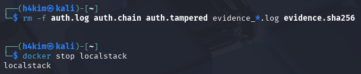

```sh
rm -f auth.log auth.chain auth.tampered evidence_*.log evidence.sha256
docker stop localstack && docker rm localstack
```
