# Lab 6 — Object Storage Security and the Data Security Lifecycle

**Course:** IKB42603 Cloud Security  
**Platform:** Amazon S3 API on LocalStack  
**Lab scope:** bucket exposure, access policies, SSE-KMS, delegated access, versioning, lifecycle management, and cryptographic erasure.  
**Lab:**  Object_Storage_and_Data_Lifecycle  
**Name:** Muhammad Amirul Hakim Bin Walid  
**Student ID:** 52215124636    
**Date:** 10 Sept 2026  

## Objective

This lab applied data-security controls throughout the object-storage lifecycle. A hospital-records bucket was created, objects were classified by sensitivity, a deliberate public-bucket breach was reproduced and remediated, and access control was tested with both identity and resource policies. The second session configured default SSE-KMS encryption, tested a presigned URL and a TLS condition, demonstrated data remanence through versioning, and configured lifecycle retention and cryptographic erasure.

## Environment and account

The AWS CLI was pointed to LocalStack at `http://localhost:4566`. The STS identity evidence shows account **000000000000** and the root ARN `arn:aws:iam::000000000000:root`. The bucket used in the evidence was `miit-patient-records-22609`.

> **LocalStack note.** Several controls were stored but not fully enforced by the LocalStack instance. These are called out below. The intended security outcome and the equivalent behaviour on AWS are stated separately from the observed result.

## Task 1 — Data classification before storage

### Steps performed

1. Created the hospital bucket.
2. Created three files representing public, internal, and confidential data.
3. Uploaded them with the `classification` object tag.
4. Listed object keys and sizes, then retrieved the tag for the confidential object.

### Evidence and result

`list-objects-v2` showed the following objects:

| Object key | Size (bytes) | Classification tag |
|---|---:|---|
| `public/notice.txt` | 29 | `public` |
| `internal/roster.txt` | 29 | `internal` |
| `confidential/record.txt` | 48 | `confidential` |

`get-object-tagging` for `confidential/record.txt` returned `classification=confidential` (Evidence 2). The `/` characters are prefixes within a flat object-key namespace, not actual folders; access policies therefore need to scope these prefixes carefully.

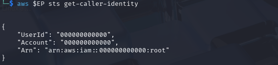

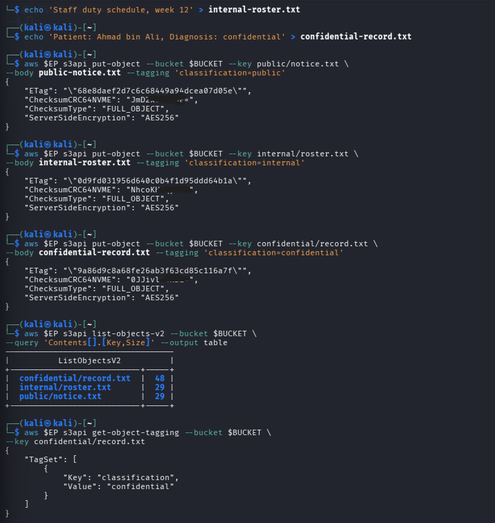

### Classification table

| Classification | Who may read it | Impact if leaked | Control applied |
|---|---|---|---|
| Public | Anyone, if formally approved for public release | Low; possible reputational or content-integrity impact | Object tag; no public policy was retained after the breach demonstration; Block Public Access enabled |
| Internal | Authenticated hospital staff with a business need, such as the approved account/analyst role | Operational disruption, privacy risk, and possible social engineering | Least-privilege bucket-policy scope to `internal/*`; time-bounded presigned URL for sharing |
| Confidential | Authorised clinical personnel only | Serious patient-privacy breach; potential PDPA/GDPR non-compliance and patient harm | Prefix-scoped explicit deny for unauthorised analyst access; SSE-KMS; versioning, lifecycle, and cryptographic-erasure capability |

## Task 2 — Reproducing the public-bucket breach

### Steps performed

1. Attached a bucket policy containing `"Principal": "*"`, `s3:GetObject`, and a resource ending in `/*`.
2. Requested `confidential/record.txt` anonymously using `curl`, with no AWS credentials.

### Evidence and result

The anonymous request returned **HTTP 200** and `leaked.txt` contained:

`Patient: Ahmad bin Ali, Diagnosis: confidential`

This demonstrates that no exploit was required: the resource policy authorised every principal to read every object in the bucket.

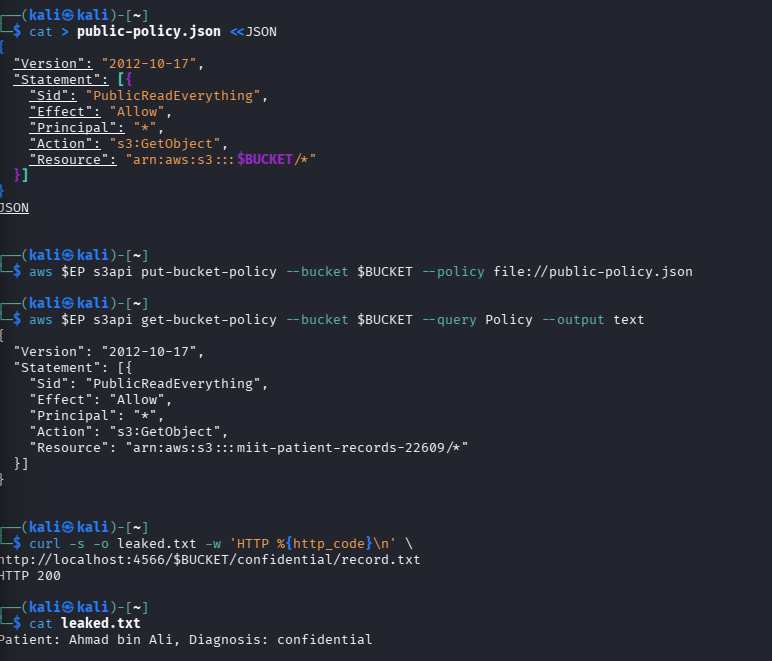

### Question: which single element caused exposure?

The single element was `"Principal": "*"`. It means *any principal*, including an anonymous internet user, is allowed by the bucket policy. It is more dangerous than an over-broad IAM policy on one user because a bucket policy is resource-based and can grant access directly to every external or anonymous requester; an overly broad IAM policy is initially limited to the identity to which it is attached.

## Task 3 — Block Public Access and least privilege

### Steps performed

1. Removed the intentionally public policy.
2. Applied Block Public Access with all four flags: `BlockPublicAcls`, `IgnorePublicAcls`, `BlockPublicPolicy`, and `RestrictPublicBuckets`.
3. Tried to reapply the public policy and retested anonymous access.
4. Replaced the public policy with a least-privilege policy granting the LocalStack account root only `s3:GetObject` on `internal/*`.

### Evidence and result

The captured Block Public Access configuration shows the guardrail configuration, including `BlockPublicPolicy: true` and `RestrictPublicBuckets: true` (Evidence 4). The re-test nevertheless returned **HTTP 200**. This is a LocalStack enforcement limitation noted by the lab; on AWS, `BlockPublicPolicy=true` would reject a public bucket policy, while `RestrictPublicBuckets=true` further restricts access granted by public policies. The final captured bucket policy is correctly scoped to `arn:aws:s3:::miit-patient-records-22609/internal/*` and the account root only.

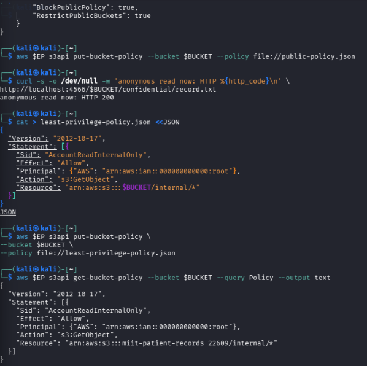

### Question: why is this a guardrail and why does it matter?

A **preventative guardrail** blocks an unsafe action before exposure happens. A **detective control** only identifies or reports that a bucket has become public after the fact. In an organisation with many engineers, Block Public Access provides a consistent account/bucket-level safety boundary: an individual mistake or an unsafe policy change cannot silently make data public while someone waits to investigate an alert.

## Task 4 — Identity policy versus resource policy

### Steps performed

1. Created IAM user `DataAnalyst`.
2. Attached an identity-based IAM policy allowing `s3:GetObject` and `s3:ListBucket` on `*`.
3. Created an analyst profile with that user's access key.
4. Attached a bucket policy intended to allow the analyst on `internal/*` and explicitly deny the analyst `s3:*` on `confidential/*`.
5. Tested the analyst against both object prefixes.

### Policy evaluation

An **identity-based policy** is attached to a caller (user, group, or role) and states what that identity may do. A **resource-based policy** is attached to the bucket and states who may access that resource. Evaluation is: default deny, then evaluate applicable policies; any matching explicit **Deny** wins; otherwise a matching **Allow** is required.

| Analyst request | Intended deciding statement | Expected AWS result |
|---|---|---|
| Read `internal/roster.txt` | IAM allows reading; bucket policy `AllowAnalystInternal` allows the `internal/*` prefix | Allowed |
| Read `confidential/record.txt` | Bucket policy `DenyAnalystConfidential` explicitly denies `s3:*` on `confidential/*` | Denied, even though IAM allows |

### Evidence and observed result

The internal read was allowed (Evidence 7). The screenshot for the confidential attempt displays object metadata, indicating that LocalStack permitted the read rather than enforcing the explicit Deny; the trailing `confidential: DENIED: command not found` is a shell-command error, not an S3 access denial. Therefore the evidence should be recorded as **LocalStack did not enforce the intended explicit-deny evaluation**. On AWS with IAM enforcement, `DenyAnalystConfidential` is the statement that decides the confidential request and it must override the broad IAM allow.

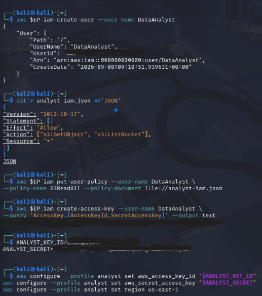

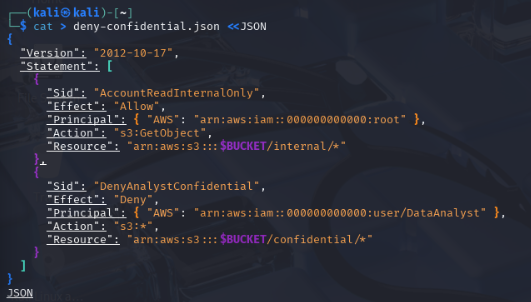

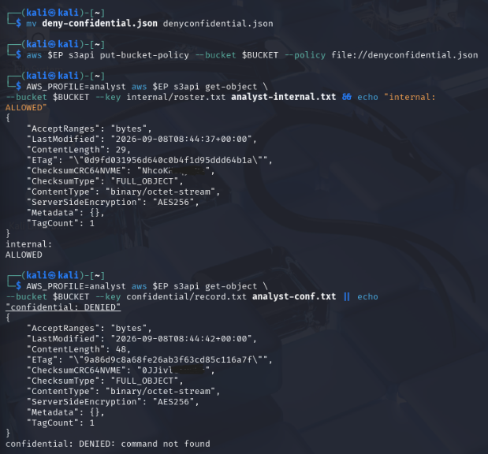

## Task 5 — Default encryption at rest with SSE-KMS

### Steps performed

1. Created a dedicated KMS key for the patient-records bucket.
2. Configured bucket default encryption as `aws:kms`, using that key and `BucketKeyEnabled: true`.
3. Uploaded `confidential/record-v2.txt` without any uploader-side encryption parameter.
4. Ran `head-object` to verify the stored object encryption settings.

### Evidence and result

The encryption configuration and `head-object` output show `aws:kms`, the dedicated KMS key ARN, and `BucketKeyEnabled` as `True` (Evidence 8–9). This proves the default bucket control encrypted the object even though the upload command did not request encryption. Bucket keys preserve confidentiality while reducing KMS calls, cost, and latency through envelope-encryption optimisation.

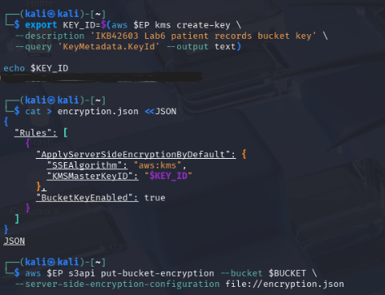

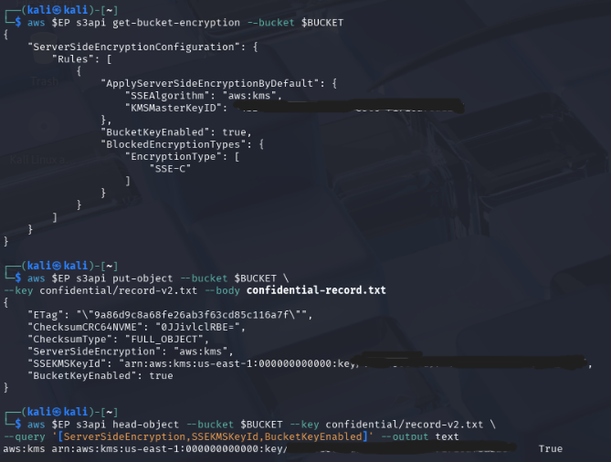

### Question: does SSE-KMS protect the record from the analyst?

No—not by itself. SSE-KMS encrypts data at rest: S3 encrypts object data using a data key, protects that key with KMS, and decrypts for an authorised S3 read. It protects against unauthorised access to stored media and helps with key control/audit. It does **not** override a successful S3 authorisation decision. If the analyst is allowed to call `GetObject` and the service can use the KMS key, S3 returns plaintext to the analyst. IAM/bucket policy and KMS key policy must enforce who can read; encryption is not a substitute for access control.

## Task 6 — Presigned URL and condition-key trap

### Steps performed

1. Generated a 60-second presigned URL for `internal/roster.txt`.
2. Requested it before expiry and again after 65 seconds.
3. Applied a bucket policy that explicitly denies any request where `aws:SecureTransport` is `false`.
4. Tested an ordinary S3 call, then removed the policy to recover.

### Evidence and result

The presigned URL read returned **HTTP 200** and displayed `Staff duty schedule, week 12` (Evidence 10). The same URL returned **HTTP 200** after the wait. This is another LocalStack limitation; AWS enforces the signed expiry.

The URL contains these important parameters:

| Parameter | Meaning |
|---|---|
| `X-Amz-Expires=60` | Maximum validity interval in seconds |
| `X-Amz-Date` | Time at which the signature was created |
| `X-Amz-Signature` | Signature binding the request details, credentials, and expiry-related parameters |

Anyone who possesses a valid presigned URL before it expires can perform the signed action on the specified object, even without an AWS identity. It must therefore be treated as a bearer secret, shared only over secure channels and issued for the smallest practical object/action/time scope.

The `DenyUnencryptedTransport` policy was applied, but `list-objects-v2` still succeeded (Evidence 11). At the LocalStack HTTP endpoint, `aws:SecureTransport` should be false; real AWS S3 uses HTTPS, where ordinary secure requests have it true and only insecure calls match the deny. The observed success is a LocalStack condition-key enforcement gap. Condition keys must always be evaluated against the actual deployment environment—copying a correct HTTPS policy into a plain-HTTP emulator can cause a lockout if enforcement is faithful.

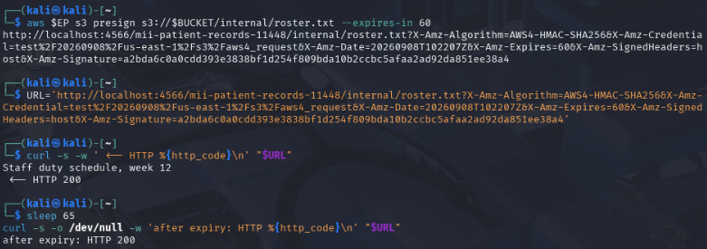

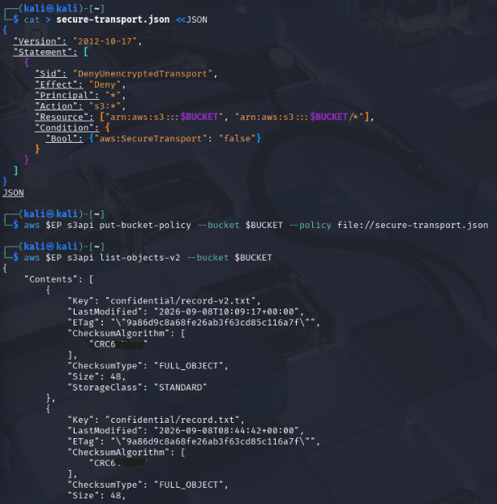


## Task 7 — Versioning, delete markers, and data remanence

### Steps performed

1. Enabled bucket versioning.
2. Uploaded a hypertension revision and then a redacted revision of `confidential/record.txt`.
3. Listed versions, deleted the object without specifying a version, and listed delete markers.
4. Attempted an ordinary read, then retrieved the original `null` version explicitly.
5. Permanently deleted the original version by its version ID.

### Evidence and result

Versioning was `Enabled` (Evidence 13). The version listing shows three versions: the current redacted version (43 bytes), the hypertension revision (48 bytes), and the original pre-versioning object with version ID `null` (48 bytes). After the ordinary delete, a current delete marker was created (Evidence 14). An ordinary read returned `NoSuchKey`, but the explicit `--version-id null` read recovered:

`Patient: Ahmad bin Ali, Diagnosis: confidential`

This is object-level data remanence: deletion of the current key did not destroy older versions. The original version was then removed explicitly with `delete-object --version-id null` (Evidence 15). Other versions/delete markers shown later in Evidence 16.1 still require separate removal if a complete erasure is required.

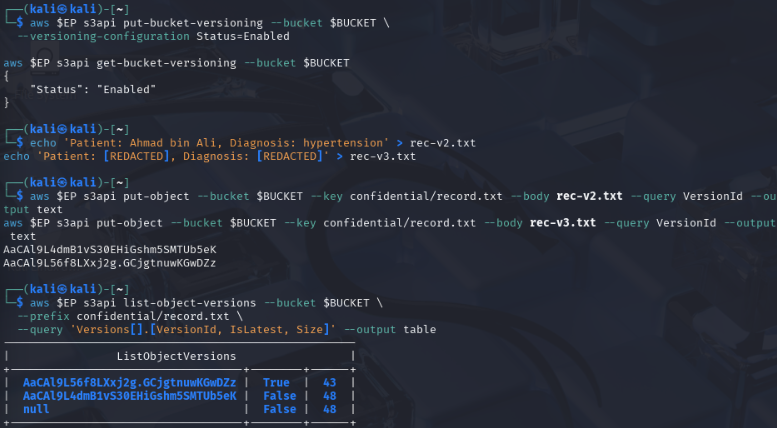

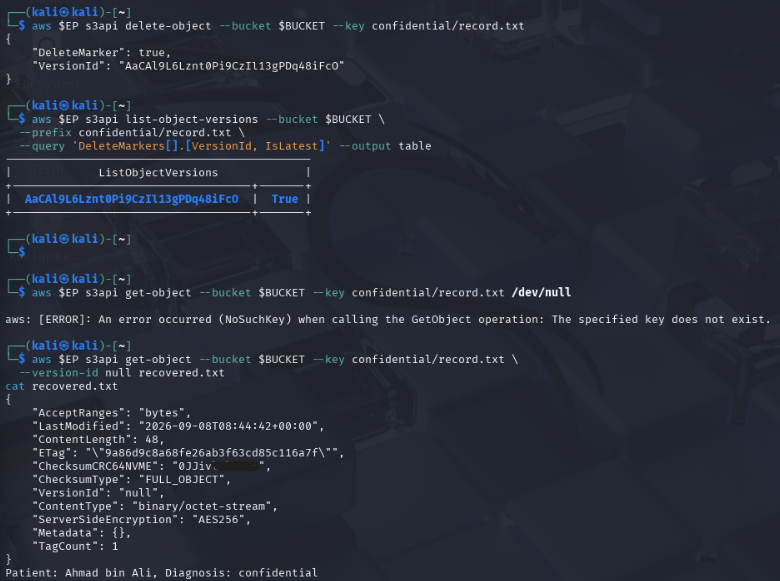

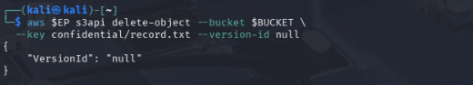

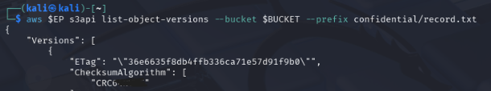

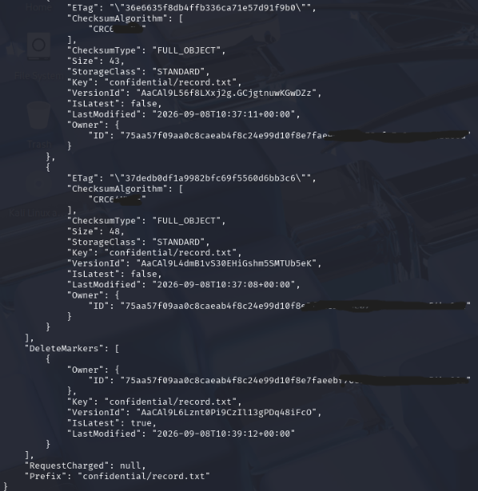

### Question: why is `delete-object` alone not compliant, and what makes erasure provable?

For a versioned bucket, a plain `delete-object` creates a delete marker rather than erasing previous versions. The recovered original patient data proves that an apparently deleted record can remain accessible by version ID; therefore it is insufficient for a data-subject erasure request under privacy regimes such as PDPA or GDPR.

Two mechanisms that make deletion defensible and provable are:

1. **Permanent per-version deletion**: enumerate and delete every object version and delete marker by its version ID, retaining command output/audit logs as evidence.
2. **Cryptographic erasure**: disable and schedule deletion of the customer-managed KMS key so ciphertext encrypted under that key becomes unrecoverable, with KMS key-state evidence.

Lifecycle rules also make routine expiration auditable and scalable, but their asynchronous operation should be evidenced and combined with version-aware retention rules.

## Task 8 — Lifecycle, retention, and cryptographic erasure

### Steps performed

1. Configured lifecycle rules to expire `confidential/` objects after 365 days, expire non-current versions after 30 days, and abort incomplete multipart uploads after 7 days.
2. Retrieved the lifecycle configuration.
3. Examined the KMS key, disabled it, and scheduled deletion with a 7-day pending window.
4. Re-read the encrypted record to test cryptographic erasure.

### Evidence and result

The captured lifecycle output shows `RetireConfidentialRecords` enabled for the `confidential/` prefix, with **365** days to expiration and **30** days for non-current-version expiration (Evidence 18). The configured JSON also includes `AbortIncompleteUploads` after seven days.

The KMS evidence shows the key state as **PendingDeletion** and a deletion date after a seven-day pending window (Evidence 17). The subsequent S3 read still returned object metadata, including `ServerSideEncryption: aws:kms`; LocalStack did not re-check disabled/pending-deletion key state for that read. On AWS, a disabled/deleted CMK prevents decrypt operations. If S3 emulation does not demonstrate it, a KMS-level `encrypt → disable-key → decrypt` test is the correct corroborating demonstration.

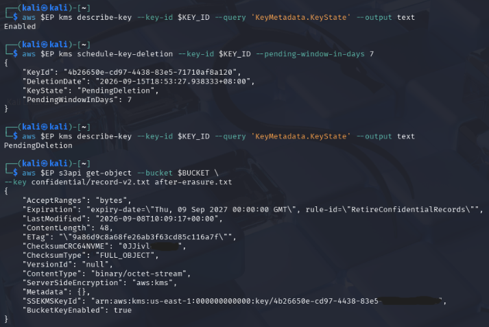

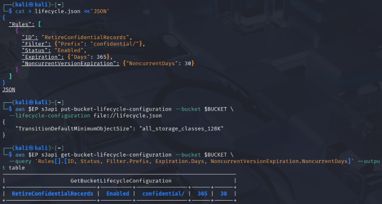

### Question: why is cryptographic erasure stronger than overwriting?

Cloud customers do not control the physical disks, replicas, backups, or media-sanitisation process. Overwriting a logical object cannot reliably prove every physical copy was overwritten. When all copies are encrypted under a customer-managed key, securely disabling and deleting that key renders all corresponding ciphertext computationally unrecoverable at once. The key state, deletion schedule, and KMS audit records provide centrally auditable evidence of erasure.

## Compliance-evidence commands

As an auditor, I would collect at least the following command outputs:

| Command | Control evidenced |
|---|---|
| `aws $EP s3api get-public-access-block --bucket $BUCKET` | All four Block Public Access guardrail flags |
| `aws $EP s3api head-object --bucket $BUCKET --key confidential/record-v2.txt --query '[ServerSideEncryption,SSEKMSKeyId,BucketKeyEnabled]' --output text` | Default SSE-KMS encryption, key identity, and bucket-key use on a real object |
| `aws $EP s3api list-object-versions --bucket $BUCKET --prefix confidential/record.txt` | Versioning, retained object versions, and delete markers for retention/erasure review |
| `aws $EP s3api get-bucket-lifecycle-configuration --bucket $BUCKET` | Automated retention and non-current-version expiration rules |
| `aws $EP kms describe-key --key-id $KEY_ID --query 'KeyMetadata.[KeyState,DeletionDate]'` | Cryptographic-erasure key state and scheduled deletion |

## Final verification posture

The lab verification block should collect the final bucket state:

```bash
echo "=== IKB42603 Lab 6 verification: $BUCKET ==="
aws $EP s3api get-public-access-block --bucket $BUCKET \
  --query 'PublicAccessBlockConfiguration' --output text
aws $EP s3api get-bucket-versioning --bucket $BUCKET --output text
aws $EP s3api get-bucket-encryption --bucket $BUCKET \
  --query 'ServerSideEncryptionConfiguration.Rules[0].ApplyServerSideEncryptionByDefault.[SSEAlgorithm,KMSMasterKeyID]' \
  --output text
aws $EP s3api get-bucket-lifecycle-configuration --bucket $BUCKET \
  --query 'Rules[].[ID,Status]' --output text
aws $EP kms describe-key --key-id $KEY_ID --query 'KeyMetadata.KeyState' --output text
```

Expected secure posture: the four public-access-block flags are true; versioning is enabled; default encryption is `aws:kms` with the dedicated key; lifecycle rules are enabled; and the KMS key is `PendingDeletion` after cryptographic-erasure scheduling. Actual LocalStack enforcement exceptions described above do not change the intended AWS posture and are explicitly evidenced.

## Security best-practices checklist

- [x] Every object was classified and tagged before access decisions (`public`, `internal`, or `confidential`).
- [x] The deliberately public policy was identified and removed; the final policy does not retain `Principal: "*"` for public read.
- [x] Block Public Access was configured with all four flags enabled (configuration evidence captured; emulator enforcement limitation noted).
- [x] Least privilege was expressed by limiting permitted reads to a key prefix rather than `/*`.
- [x] Default encryption at rest was set to `aws:kms` with a customer-managed key and bucket key enabled.
- [x] Sharing was demonstrated with a 60-second, single-object presigned URL rather than a permanent public object.
- [x] Versioning was enabled and the delete-marker/remanence behaviour was demonstrated.
- [x] Lifecycle rules express retention, and KMS key disabling/scheduled deletion provides cryptographic-erasure capability.

## Conclusion

The lab showed that object-storage security depends on the full lifecycle, not a single setting. Classification determined the appropriate protection; a single wildcard principal caused a real anonymous disclosure; and preventative guardrails plus prefix-scoped policies reduced that risk. SSE-KMS protected stored data but did not replace authorisation. Versioning preserved recoverable historical data after an apparent delete, demonstrating why erasure requires version-aware deletion and/or cryptographic erasure. Finally, lifecycle rules and KMS key-state evidence turn retention and destruction from manual claims into auditable controls. The LocalStack results also reinforce the need to validate policy enforcement in the environment that will actually host the workload.
